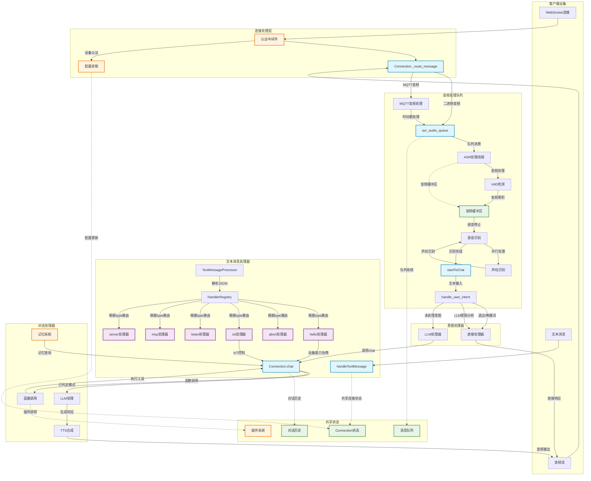
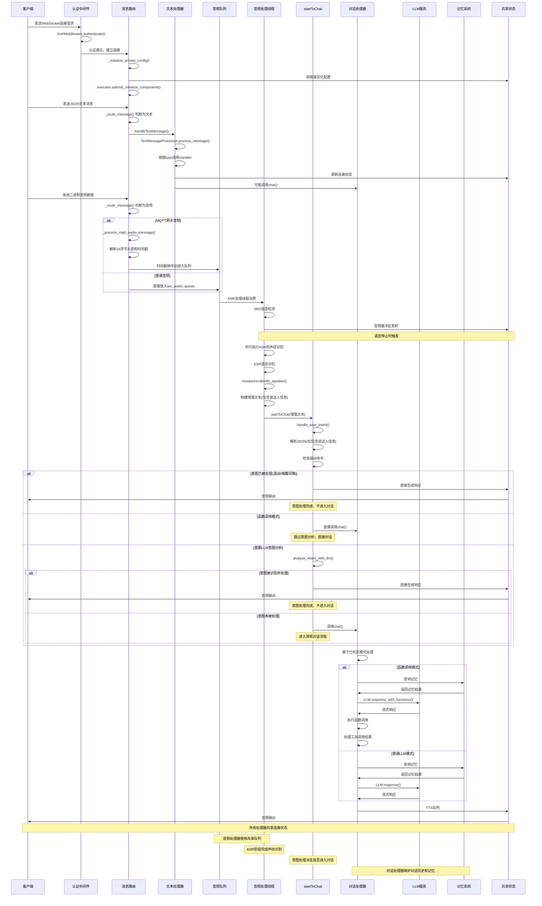

# xiaozhi-server 消息处理架构图

## 消息处理层整体关系



## 详细消息处理流程



## 处理器职责分工表

| 处理器 | 主要职责 | 输入 | 输出 | 触发条件 |
|--------|----------|------|------|----------|
| **认证中间件** | 设备认证 | WebSocket Headers、设备ID | 认证结果 | 新建WebSocket连接 |
| **文本消息处理器** | 协议控制、设备管理 | JSON字符串 | 控制指令、状态更新 | 收到WebSocket文本消息 |
| **音频处理队列** | 音频数据管理、MQTT处理 | 二进制音频数据、MQTT音频包 | 排序后的音频数据 | 收到WebSocket音频消息 |
| **音频处理线程** | 语音检测、识别、声纹识别 | 音频缓冲区数据 | 增强文本(含说话人信息) | 音频队列被消费且语音停止 |
| **startToChat处理器** | 意图分析、请求分流 | 识别文本、JSON数据 | 直接响应或chat调用 | ASR识别完成或文本输入 |
| **对话处理器** | 智能对话、工具调用、记忆管理 | 文本查询、上下文 | 音频响应、函数结果 | 意图未被处理且需要LLM |
| **记忆系统** | 短期记忆、长期记忆查询 | 用户查询、角色ID | 记忆上下文 | 每次调用chat时 |
| **TTS系统** | 语音合成 | LLM响应文本 | 音频流 | LLM生成响应后 |

## 关键组件实现细节

### 1. 消息路由实现 (`Connection._route_message`)

消息路由是系统的核心，负责根据消息类型进行分发：

```python
async def _route_message(self, message):
    """消息路由"""
    if isinstance(message, str):
        # 文本消息路由到文本处理器
        await handleTextMessage(self, message)
    elif isinstance(message, bytes):
        # 音频消息处理
        if self.vad is None or self.asr is None:
            return

        # 处理来自MQTT网关的音频包
        if self.conn_from_mqtt_gateway and len(message) >= 16:
            handled = await self._process_mqtt_audio_message(message)
            if handled:
                return

        # 普通音频直接放入队列
        self.asr_audio_queue.put(message)
```

### 2. MQTT音频包处理

MQTT网关发送的音频包包含16字节头部，需要特殊处理：

```python
async def _process_mqtt_audio_message(self, message):
    """处理来自MQTT网关的音频消息，解析16字节头部"""
    try:
        # 提取头部信息
        timestamp = int.from_bytes(message[8:12], "big")
        audio_length = int.from_bytes(message[12:16], "big")

        # 提取音频数据
        if audio_length > 0 and len(message) >= 16 + audio_length:
            audio_data = message[16 : 16 + audio_length]
            # 基于时间戳进行排序处理
            self._process_websocket_audio(audio_data, timestamp)
            return True
    except Exception as e:
        self.logger.bind(tag=TAG).error(f"解析WebSocket音频包失败: {e}")
    return False
```

### 3. ASR和声纹识别并行处理 (`handle_voice_stop`)

ASR处理阶段会并行执行语音识别和声纹识别，然后生成增强文本：

```python
async def handle_voice_stop(self, conn, asr_audio_task):
    """处理语音停止事件"""
    # 并行执行ASR和声纹识别任务
    with ThreadPoolExecutor(max_workers=2) as executor:
        asr_future = executor.submit(run_asr)
        voiceprint_future = executor.submit(run_voiceprint)

        # 等待两个任务完成
        asr_result = asr_future.result()
        speaker_name = voiceprint_future.result()

    # 构建包含说话人信息的增强文本
    enhanced_text = self._build_enhanced_text(asr_result, speaker_name)

    # 调用startToChat进行意图处理
    await startToChat(conn, enhanced_text)
```

### 4. 意图处理流程 (`handle_user_intent`)

意图处理是系统的关键分流点，决定请求是否需要进入对话：

```python
async def handle_user_intent(conn, text):
    """意图处理主函数"""
    # 预处理输入文本，处理可能的JSON格式（包含说话人信息）
    try:
        if text.strip().startswith('{') and text.strip().endswith('}'):
            parsed_data = json.loads(text)
            if isinstance(parsed_data, dict) and "content" in parsed_data:
                text = parsed_data["content"]
                conn.current_speaker = parsed_data.get("speaker")
    except (json.JSONDecodeError, TypeError):
        pass

    # 检查是否有明确的退出命令
    if await check_direct_exit(conn, text):
        return True  # 意图已处理

    # 检查是否是唤醒词
    if await checkWakeupWords(conn, text):
        return True  # 意图已处理

    if conn.intent_type == "function_call":
        # 函数调用模式，跳过意图分析，直接进入对话
        return False

    # 使用LLM进行意图分析
    intent_result = await analyze_intent_with_llm(conn, text)
    if not intent_result:
        return False  # 意图未识别，进入对话

    # 处理识别到的意图
    return await process_intent_result(conn, intent_result, text)
```

### 5. 对话处理流程 (`Connection.chat`)

对话处理只在意图未被处理时执行，基于已判定的模式进行处理：

```python
def chat(self, query, depth=0):
    """对话处理主函数 - 只在意图未被处理时调用"""
    self.llm_finish_task = False

    # 为最顶层时新建会话ID和发送FIRST请求
    if depth == 0:
        self.sentence_id = str(uuid.uuid4().hex)
        self.dialogue.put(Message(role="user", content=query))
        # 发送TTS开始信号
        self.tts.tts_text_queue.put(TTSMessageDTO(
            sentence_id=self.sentence_id,
            sentence_type=SentenceType.FIRST,
            content_type=ContentType.ACTION,
        ))

    # 根据意图类型选择处理方式（已在调用前确定）
    functions = None
    if self.intent_type == "function_call" and hasattr(self, "func_handler"):
        functions = self.func_handler.get_functions()
    response_message = []

    try:
        # 每次chat都会查询记忆系统获取相关上下文
        memory_str = None
        if self.memory is not None:
            future = asyncio.run_coroutine_threadsafe(
                self.memory.query_memory(query), self.loop
            )
            memory_str = future.result()

        if self.intent_type == "function_call" and functions is not None:
            # 支持函数调用的LLM处理
            llm_responses = self.llm.response_with_functions(
                self.session_id,
                self.dialogue.get_llm_dialogue_with_memory(
                    memory_str, self.config.get("voiceprint", {})
                ),
                functions=functions,
            )
        else:
            # 普通LLM处理
            llm_responses = self.llm.response(
                self.session_id,
                self.dialogue.get_llm_dialogue_with_memory(
                    memory_str, self.config.get("voiceprint", {})
                ),
            )
    except Exception as e:
        self.logger.bind(tag=TAG).error(f"LLM 处理出错 {query}: {e}")
        return None

    # 处理流式响应
    tool_call_flag = False
    for response in llm_responses:
        if self.client_abort:
            break
        # 处理响应内容并填充 response_message
        # ... (流式响应处理逻辑)

    # 存储对话内容到历史记录（统一处理，适用于普通模式和函数调用模式）
    if len(response_message) > 0:
        text_buff = "".join(response_message)
        self.tts_MessageText = text_buff
        self.dialogue.put(Message(role="assistant", content=text_buff))
```

### 6. 记忆系统和对话历史维护机制

**记忆查询时机**：
- 每次调用`chat()`方法时都会执行记忆查询
- 为当前对话提供相关的历史上下文
- 支持短期记忆和长期记忆检索

**对话历史维护**：
- 每次chat结束时都会将助手响应存储到对话历史中
- 通过`self.dialogue.put(Message(role="assistant", content=text_buff))`实现
- 为后续对话提供完整的上下文支持

这种设计确保了每次对话都能获得完整的记忆支持，并且持续维护对话历史。

### 7. 认证和配置管理

每个连接都需要经过认证和配置初始化：

```python
async def handle_connection(self, ws):
    try:
        # 获取并验证headers
        self.headers = dict(ws.request.headers)

        # 进行认证
        await self.auth.authenticate(self.headers)

        # 认证通过后获取差异化配置
        self._initialize_private_config()
        # 异步初始化组件（包含记忆和意图识别）
        self.executor.submit(self._initialize_components)
```

## 系统特性说明

### 1. 多模态支持
- **文本消息**：JSON格式的控制指令和状态更新
- **音频消息**：支持实时语音识别和MQTT网关音频包
- **视觉消息**：通过HTTP接口提供图像识别服务

### 2. 智能处理能力
- **意图识别**：支持函数调用和LLM意图识别两种模式
- **记忆管理**：每次对话都查询记忆并维护对话历史，支持短期记忆和长期记忆
- **声纹识别**：基于用户语音特征的身份验证

### 3. 插件扩展性
- **工具调用**：支持IoT设备控制、MCP协议、插件系统
- **函数注册**：动态加载和注册功能插件
- **提供商抽象**：支持多种AI服务提供商

### 4. 容错和稳定性
- **连接管理**：自动重连和超时处理
- **错误恢复**：组件级错误隔离和恢复
- **资源管理**：线程池和内存使用优化
