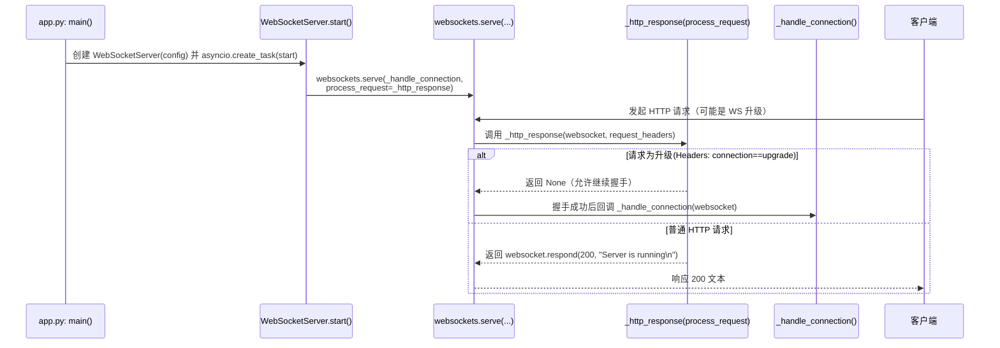

# App.py 主要脉络与 WebSocket 功能分析
# 图

## 概述

本文档详细分析了小智 ESP32 服务器中 `app.py` 的主要脉络和 `websocket_server.py` 的功能实现，帮助理解整个系统的启动流程和核心工作原理。

## App.py 主要脉络

### 初始化阶段 (app.py:45-62)

```python
async def main():
    check_ffmpeg_installed()
    config = load_config()
    
    # 认证密钥设置
    auth_key = config.get("manager-api", {}).get("secret", "")
    if not auth_key or len(auth_key) == 0 or "你" in auth_key:
        auth_key = str(uuid.uuid4().hex)
    config["server"]["auth_key"] = auth_key
    
    # 启动三大核心服务
    stdin_task = asyncio.create_task(monitor_stdin())
    ws_server = WebSocketServer(config)
    ws_task = asyncio.create_task(ws_server.start())
    ota_server = SimpleHttpServer(config)
    ota_task = asyncio.create_task(ota_server.start())
```

**核心组件**：
- **配置加载**：`load_config()` 加载完整的服务器配置
- **认证密钥设置**：生成或使用 JWT 认证密钥用于视觉分析接口认证
- **WebSocketServer** - 主要的 WebSocket 通信服务
- **SimpleHttpServer** - HTTP 服务（OTA升级、视觉分析接口）
- **stdin_task** - 标准输入监控任务

### 运行阶段

**三大服务并行运行**：
- 所有服务运行在 asyncio 事件循环中
- 等待退出信号（Ctrl+C / SIGTERM）
- 优雅关闭所有服务，确保资源清理

**关键接口地址**：
- WebSocket: `ws://IP:8000/xiaozhi/v1/`
- OTA接口: `http://IP:8003/xiaozhi/ota/`
- 视觉分析: `http://IP:8003/mcp/vision/explain`

## WebSocketServer.start() 启动的功能

### 模块初始化 (websocket_server.py:17-31)

```python
modules = initialize_modules(
    self.logger, self.config,
    "VAD" in self.config["selected_module"],
    "ASR" in self.config["selected_module"], 
    "LLM" in self.config["selected_module"],
    False,
    "Memory" in self.config["selected_module"],
    "Intent" in self.config["selected_module"],
)
```

**启动的核心AI功能模块**：
- **VAD (语音活动检测)**：检测用户语音的开始和结束
- **ASR (语音识别)**：将语音转换为文本
- **LLM (大语言模型)**：进行自然语言理解和生成
- **Memory (记忆系统)**：管理对话历史和用户记忆
- **Intent (意图识别)**：识别用户意图，支持函数调用

### WebSocket 服务启动 (websocket_server.py:40-43)

```python
async with websockets.serve(
    self._handle_connection, host, port, process_request=self._http_response
):
    await asyncio.Future()
```

**服务特性**：
- 监听配置的端口（默认8000）
- 同时支持 WebSocket 连接和 HTTP 请求
- 为每个连接创建独立的 ConnectionHandler
- 提供配置热更新功能 `update_config()`

## 功能模块协调执行机制

### ConnectionHandler 核心架构

#### 初始化阶段 (connection.py:164-217)

1. **认证验证**：Bearer token 白名单认证确保连接安全
2. **私有配置获取**：从 API 获取设备专属配置
3. **异步组件初始化**：在后台线程中初始化 TTS、ASR 等组件
4. **超时检查任务**：防止连接长时间无响应

#### 关键组件状态管理

```python
# AI服务组件
self.vad = None           # 语音活动检测
self.asr = None           # 语音识别
self.tts = None           # 语音合成
self.llm = _llm          # 大语言模型
self.memory = _memory    # 记忆系统
self.intent = _intent    # 意图识别

# 客户端状态
self.client_abort = False
self.client_is_speaking = False
self.client_listen_mode = "auto"

# 音频处理队列
self.asr_audio_queue = queue.Queue()
self.client_audio_buffer = bytearray()

# 对话管理
self.dialogue = Dialogue()
self.llm_finish_task = True
```

### 消息路由机制 (connection.py:279-288)

```python
async def _route_message(self, message):
    if isinstance(message, str):
        await handleTextMessage(self, message)  # 文本消息处理
    elif isinstance(message, bytes):
        if self.vad is None or self.asr is None:
            return
        self.asr_audio_queue.put(message)  # 音频数据入队
```

## 核心工作流程

### 语音交互流程

1. **音频接收** → `asr_audio_queue` 队列
2. **VAD处理** → 检测语音活动，判断是否开始/结束说话
3. **ASR转换** → 语音转文本
4. **意图识别** → 分析用户意图（普通对话/函数调用）
5. **LLM处理** → 生成回复内容
6. **TTS合成** → 文本转语音
7. **音频发送** → 返回给客户端

### 文本交互流程

*注意：此流程不是指客户直接输入文本，而是系统内部处理ASR转换后的文本或控制消息*

1. **ASR结果接收** → 语音识别转换后的文本进入 `handleTextMessage()`
2. **LLM处理** → 对文本进行理解和生成回复
3. **TTS合成** → 将回复文本转换为语音（可选）
4. **响应返回** → 音频格式返回给ESP32设备

**实际场景**：
- ESP32设备发送音频数据 → 服务器ASR转换为文本 → LLM处理 → TTS合成 → 返回音频给ESP32
- 支持中途打断：`client_abort` 标志控制响应生成过程

## 关键协调机制

### 线程池管理

```python
self.executor = ThreadPoolExecutor(max_workers=5)
self.report_queue = queue.Queue()
self.report_thread = None
```

- 处理 CPU 密集型任务（TTS、ASR等）
- 异步保存记忆到独立线程
- 上报队列处理统计数据

### 状态管理

- **活动时间戳**：`last_activity_time` 用于超时检测
- **对话状态**：`client_is_speaking`、`client_abort` 等标志
- **音频缓冲**：`client_audio_buffer` 管理音频数据流
- **超时检查**：`timeout_task` 防止僵尸连接

### 插件系统

```python
auto_import_modules("plugins_func.functions")
self.func_handler = None  # 延迟初始化
```

- **自动加载**：`plugins_func/functions/` 目录下的功能插件
- **延迟初始化**：在 `_initialize_intent()` 中创建 `UnifiedToolHandler(self)`
- **异步初始化**：调用 `func_handler._initialize()` 完成初始化
- **统一接口**：`UnifiedToolHandler` 统一工具调用
- **扩展功能**：音乐播放、天气查询、IoT控制等

### 错误处理和恢复

- **异常捕获**：完整的异常捕获和日志记录
- **资源清理**：连接断开时的资源清理机制
- **记忆保存**：异步保存对话记忆，容错处理
- **优雅关闭**：确保所有任务正确终止

## 系统架构特点

### 1. 事件驱动架构
- 基于 asyncio 的异步处理
- 消息队列驱动的音频处理
- 非阻塞的 I/O 操作

### 2. 模块化设计
- 各AI服务模块独立初始化
- 清晰的职责分离
- 插件化的功能扩展

### 3. 高并发处理
- 每个连接独立的处理实例
- 线程池处理CPU密集型任务
- 异步I/O处理网络通信

### 4. 容错机制
- 完善的错误处理和日志记录
- 连接超时和资源清理
- 配置热更新支持

#### 关键失败场景处理

**AI服务不可用场景**:
- **LLM API 限流/故障**: 降级到简单回复或排队机制
  ```python
  # 示例: LLM 服务失败后降级策略
  if llm_service_failure:
      fallback_response = "抱歉，我暂时无法理解您的问题，请稍后再试。"
      await send_text_response(conn, fallback_response)
  ```
- **ASR 服务超时**: 音频片段缓存与重试策略
  ```python
  # ASR 重试机制
  max_retries = 3
  for attempt in range(max_retries):
      try:
          result = await asr_service.transcribe(audio_chunk)
          break
      except TimeoutError:
          if attempt == max_retries - 1:
              await send_error_audio(conn, "voice_recognition_failed.wav")
  ```
- **TTS 服务异常**: 文本回复降级方案
  ```python
  # TTS 失败后只返回文本
  try:
      audio_response = await tts_service.synthesize(text)
      await send_audio(conn, audio_response)
  except TTSError:
      await send_text_only(conn, text)  # 降级为纯文本回复
  ```

**网络连接异常处理**:
- **WebSocket 断线重连**: ESP32 端的重连退避算法
  ```python
  # 连接断开后的清理逻辑
  async def cleanup_connection(self):
      self.stop_event.set()
      if self.timeout_task:
          self.timeout_task.cancel()
      await self._save_and_close(self.websocket)
  ```
- **部分连接占用过多资源**: 连接级别的资源限制与强制清理
  ```python
  # 连接资源监控
  MAX_AUDIO_BUFFER_SIZE = 10 * 1024 * 1024  # 10MB
  if len(self.client_audio_buffer) > MAX_AUDIO_BUFFER_SIZE:
      logger.warning(f"连接 {self.device_id} 音频缓冲区超限，强制清理")
      self.client_audio_buffer.clear()
  ```
- **网络分区场景**: 本地缓存与离线模式支持
  ```python
  # 网络不可用时的本地处理
  if network_unavailable:
      local_responses = ["网络连接中断，请检查网络设置"]
      await send_cached_response(conn, local_responses)
  ```

**资源耗尽处理**:
- **内存不足**: 连接限流与优先级清理
- **CPU 超载**: 任务队列限制与背压控制
- **线程池满载**: 任务丢弃与警告机制

## 性能优化

### 1. 资源管理
- 线程池限制并发任务数量
- 连接级别的资源隔离
- 音频数据流式处理

### 2. 缓存机制
- 模块级别的缓存管理
- 配置信息缓存
- 对话历史管理

### 3. 异步处理
- 非阻塞的AI服务调用
- 异步的音频处理
- 并发的连接处理

### 4. 容量规划与性能瓶颈

#### 内存占用估算
- **每个 ConnectionHandler**: 2-5MB
  - 音频缓冲区 (client_audio_buffer): ~100KB-1MB
  - 对话历史 (dialogue): ~50KB-500KB  
  - ASR 音频队列: ~200KB-2MB
  - 其他状态变量: ~50KB
- **1000个并发连接**: 2-5GB RAM
- **VAD/ASR 本地模型**: 额外 1-4GB (取决于模型大小)
- **LLM 本地模型**: 4-16GB (如果启用本地推理)

#### CPU瓶颈点识别
- **本地 ASR 推理**: CPU密集型，单次处理 200-500ms
- **TTS 合成**: CPU/GPU密集，可能成为主要瓶颈
- **VAD 实时检测**: 持续的轻量级 CPU 占用
- **JSON 序列化/反序列化**: 高并发时的隐形开销
- **音频格式转换**: FFmpeg 调用的 CPU 开销

#### 网络带宽需求
- **实时音频流**: 16kHz/16bit = ~32KB/s per connection
- **1000连接场景**: ~32MB/s 上行 + 下行带宽需求
- **TTS 音频返回**: 压缩后约 8-16KB/s per active session
- **WebSocket 控制消息**: 可忽略 (<1KB/s per connection)

#### 性能调优建议
- **连接数限制**: 建议单实例 200-500 连接
- **线程池配置**: ThreadPoolExecutor max_workers=5-10
- **音频队列限制**: 防止内存无限增长
- **AI 服务超时**: ASR 3s, LLM 10s, TTS 5s

## 扩展性设计

### 1. 插件系统
- 动态加载功能插件
- 统一的工具调用接口
- 可扩展的意图识别

### 2. 配置驱动
- 模块启用/禁用配置
- 服务提供商可配置
- 设备差异化配置

### 3. 接口标准化
- 统一的AI服务接口
- 标准的消息格式
- 规范的错误处理

## 安全架构

### 1. 认证与授权

#### Bearer Token 白名单认证机制
```python
# Bearer token 白名单认证
# AuthMiddleware 类维护 token 白名单
self.tokens = {
    item["token"]: item["name"]
    for item in self.auth_config.get("tokens", [])
}

# 连接时的认证验证
await self.auth.authenticate(self.headers)
# 验证 Authorization: Bearer <token> 格式
# 同时支持设备白名单验证
```

#### 访问控制策略
- **设备级别验证**: device-id 与 client-id 绑定验证
- **API 速率限制**: 防止恶意调用和 DDoS 攻击
- **IP 白名单**: 限制特定 IP 地址访问
- **连接数限制**: 单设备最大并发连接数

```python
# 连接数限制示例
MAX_CONNECTIONS_PER_DEVICE = 3
if len(device_connections[device_id]) >= MAX_CONNECTIONS_PER_DEVICE:
    await websocket.close(code=1013, reason="Too many connections")
```

### 2. 数据安全

#### 传输加密
- **WSS 协议**: WebSocket 连接必须使用 TLS 加密
- **HTTPS**: HTTP 接口必须启用 SSL/TLS
- **证书管理**: 自动更新 SSL 证书

> **注意**: 以下为建议的安全实现示例，当前代码库中暂未实现

```python
# TLS 配置示例（建议实现）
ssl_context = ssl.create_default_context(ssl.Purpose.CLIENT_AUTH)
ssl_context.load_cert_chain(certfile, keyfile)
await websockets.serve(handler, host, port, ssl=ssl_context)
```

#### 敏感数据处理
- **音频数据临时性**: 避免长期存储用户音频
- **内存清理**: 对话结束后立即清理敏感信息
- **日志脱敏**: 日志中不记录敏感信息
- **API 密钥保护**: 加密存储 AI 服务的 API 密钥

```python
# 建议的敏感数据清理实现
async def cleanup_sensitive_data(self):
    self.client_audio_buffer.clear()
    if hasattr(self, 'dialogue'):
        self.dialogue.clear_sensitive_content()
    # 清理其他敏感状态
```

### 3. IoT 控制安全（建议实现）

#### 指令验证与审计
- **指令白名单**: 只允许执行预定义的安全指令
- **权限检查**: 验证设备是否有权执行特定操作
- **操作审计**: 记录所有 IoT 控制指令的执行日志
- **危险操作拦截**: 识别并阻止潜在的危险指令

```python
# 建议的 IoT 指令安全验证实现
SAFE_IOT_COMMANDS = {
    "light_control": ["on", "off", "brightness"],
    "temperature": ["set_temperature"],
    "music": ["play", "pause", "volume"]
}

DANGEROUS_PATTERNS = [
    r"rm\s+-rf",  # 系统删除命令
    r"sudo",      # 提权命令
    r"admin",     # 管理员权限
]

async def validate_iot_command(command, device_id):
    # 检查危险模式
    for pattern in DANGEROUS_PATTERNS:
        if re.search(pattern, command, re.IGNORECASE):
            logger.warning(f"设备 {device_id} 尝试执行危险指令: {command}")
            return False
    return True
```

#### 插件系统安全
- **插件签名**: 验证插件的可信性
- **沙箱执行**: 限制插件的执行权限
- **资源限制**: 限制插件的内存和 CPU 使用

```python
# 建议的插件安全执行实现
import resource

def execute_plugin_safely(plugin_func, *args, **kwargs):
    # 设置资源限制
    resource.setrlimit(resource.RLIMIT_AS, (100*1024*1024, 100*1024*1024))  # 100MB

    try:
        with timeout(5):  # 5秒超时
            return plugin_func(*args, **kwargs)
    except Exception as e:
        logger.error(f"插件执行异常: {e}")
        return None
```

### 4. 安全监控与响应（建议实现）

#### 实时威胁检测
- **异常连接模式**: 检测高频连接/断开行为
- **恢意负载**: 识别超大音频数据或消息洪水
- **异常指令检测**: AI 生成内容的安全性检测

```python
# 建议的安全监控实现
class SecurityMonitor:
    def __init__(self):
        self.connection_attempts = defaultdict(list)
        self.suspicious_devices = set()

    def check_connection_rate(self, client_ip):
        now = time.time()
        attempts = self.connection_attempts[client_ip]
        # 清理旧记录
        attempts[:] = [t for t in attempts if now - t < 60]
        attempts.append(now)

        if len(attempts) > 10:  # 1分钟内超过10次连接
            logger.warning(f"可疑连接行为: {client_ip}")
            return False
        return True
```

#### 事件响应机制
- **自动隔离**: 检测到威胁后自动隔离可疑设备
- **紧急停机**: 重大安全事件后的系统保护
- **安全通告**: 向管理员发送安全警告

```python
# 建议的安全事件响应实现
async def handle_security_incident(incident_type, details):
    if incident_type == "suspicious_activity":
        await isolate_device(details["device_id"])
        await notify_admin(f"检测到可疑活动: {details}")
    elif incident_type == "critical_breach":
        await emergency_shutdown()
        await send_alert_notification(details)
```

---

*文档创建时间: 2025-08-21*