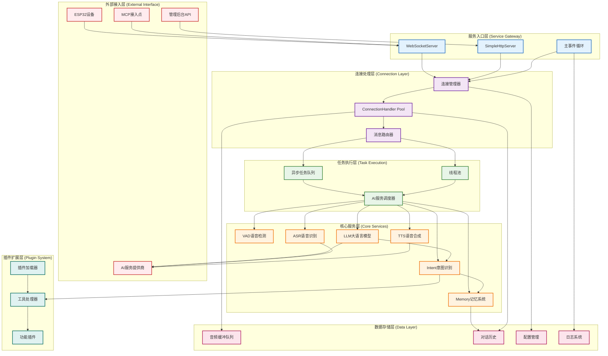
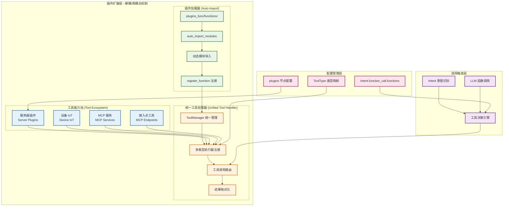
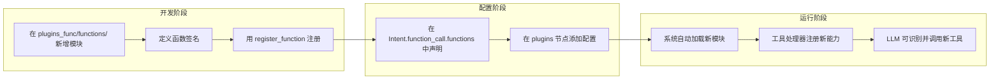

# 系统总体架构概览

> **说明：** 这是小智ESP32服务器的核心架构层次图，展示了主要的系统层级和组件关系。

## 系统分层架构

## 架构层次说明

### 1. 外部接入层 (External Interface)
- **ESP32设备**：硬件客户端，通过WebSocket连接
- **管理后台API**：系统管理和监控接口
- **MCP接入点**：Model Context Protocol 集成点
- **AI服务提供商**：OpenAI、阿里云、豆包等第三方AI服务

### 2. 服务入口层 (Service Gateway)
- **WebSocketServer**：主要的WebSocket服务器
- **SimpleHttpServer**：HTTP API服务器
- **主事件循环**：统一的异步事件调度中心

### 3. 连接处理层 (Connection Layer)
- **连接管理器**：管理所有客户端连接的生命周期
- **ConnectionHandler Pool**：为每个连接创建独立的处理实例
- **消息路由器**：负责消息的分发和路由

### 4. 任务执行层 (Task Execution)
- **异步任务队列**：I/O密集型任务的异步处理
- **线程池**：CPU密集型任务的并行处理
- **AI服务调度器**：协调各AI服务的调用

### 5. 核心服务层 (Core Services)
- **VAD语音检测**：语音活动检测
- **ASR语音识别**：语音转文本
- **LLM大语言模型**：文本理解和生成
- **TTS语音合成**：文本转语音
- **Memory记忆系统**：对话历史管理
- **Intent意图识别**：用户意图理解

#### 核心服务调用关系
- **LLM → Intent**：LLM处理用户输入后调用Intent进行意图识别
- **Intent → Memory**：Intent根据识别结果更新或查询Memory中的对话历史
- **Intent → 工具处理器**：Intent识别到需要工具调用时触发插件系统
- **Memory → 对话历史**：Memory系统将对话数据持久化到数据存储层

### 6. 插件扩展层 (Plugin System)
- **插件加载器**：动态加载功能插件
- **工具处理器**：统一的工具调用处理
- **功能插件**：音乐播放、天气查询、IoT控制等

#### 工具和插件层的解耦/再耦合机制

工具和插件层承担了将 LLM 对话与外部能力解耦／再耦合的关键机制：

##### 工具和插件的核心设计理念

**1. 解耦机制**
- **插件加载器**：通过 `auto_import_modules` 自动发现和导入 `plugins_func/functions/` 下的所有模块
- **统一工具处理器**：将不同来源的工具能力抽象为统一的调用接口
- **工具类型系统**：通过 `ToolType` 枚举区分不同类型的工具能力

**2. 再耦合机制**
- ** Intent/LLM 决策**：根据对话内容判断是否需要调用工具
- **配置驱动**：通过 `Intent.function_call.functions` 配置启用哪些工具
- **动态调用**：运行时根据工具名称和参数执行具体功能

**3. 工具能力分类**
- **服务器插件 (Server Plugins)**：天气、新闻、音乐、Home Assistant 等
- **设备 IoT (Device IoT)**：硬件设备控制和状态查询
- **MCP 服务 (MCP Services)**：Model Context Protocol 集成服务
- **接入点工具 (MCP Endpoints)**：外部服务接入点

##### 扩展新工具的标准流程

这种设计让工具和插件层成为了一个**扩展平台**，能够：
- **动态扩展**：新功能无需修改核心代码
- **统一管理**：所有工具通过同一接口调用
- **配置驱动**：通过配置文件控制可用工具
- **类型安全**：通过 ToolType 确保工具调用的正确性

### 7. 数据存储层 (Data Layer)
- **音频缓冲队列**：音频数据的缓存和队列
- **对话历史**：会话记录和上下文
- **配置管理**：系统配置和参数
- **日志系统**：系统运行日志

## 核心设计原则

### 1. 分层解耦
每层职责清晰，通过标准接口通信，便于独立开发和测试。

### 2. 异步优先
采用异步编程模型，提高并发处理能力和资源利用率。

### 3. 插件化架构
核心功能可通过插件扩展，增强系统的可扩展性和灵活性。

### 4. 连接隔离
每个客户端连接拥有独立的处理上下文，确保多连接之间的隔离。

### 5. 服务化集成
AI服务通过统一接口集成，支持多种服务提供商的切换。

---

📋 **相关文档导航：**
- [02_连接管理架构](02_connection_management.md) - 连接处理层详细设计
- [03_AI服务集成架构](03_ai_services_integration.md) - AI服务层集成方式
- [04_数据流处理架构](04_data_flow.md) - 数据流向和处理流程
- [05_并发处理架构](05_concurrency_model.md) - 并发处理模型
- [06_生命周期管理架构](06_lifecycle_management.md) - 连接生命周期管理

*图表创建时间：2025-08-24*
