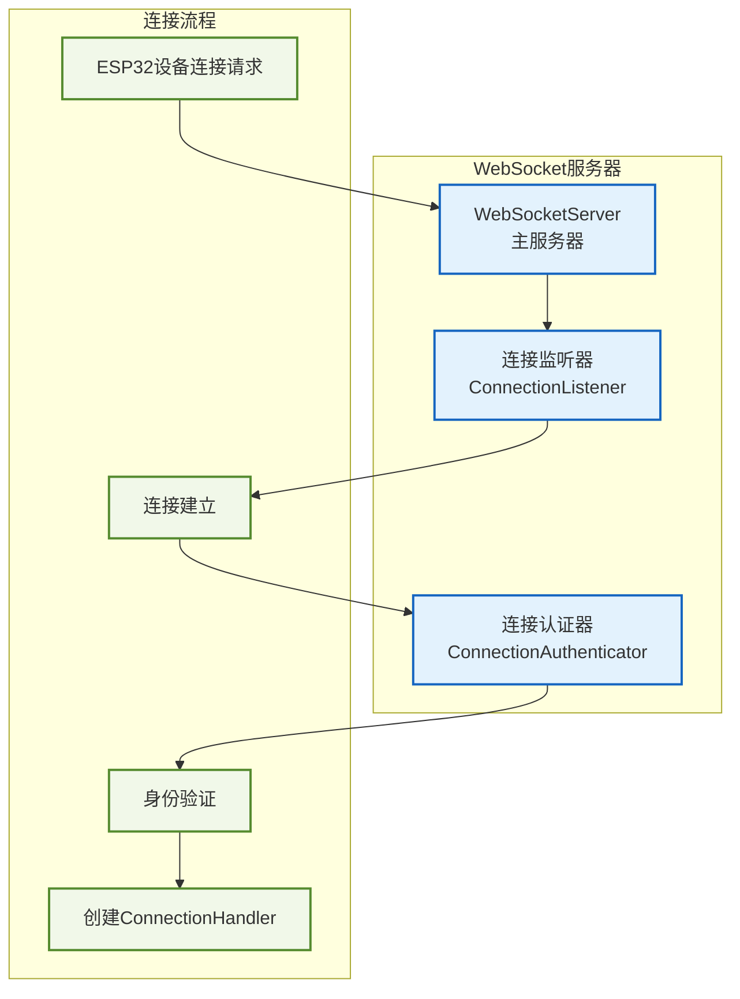
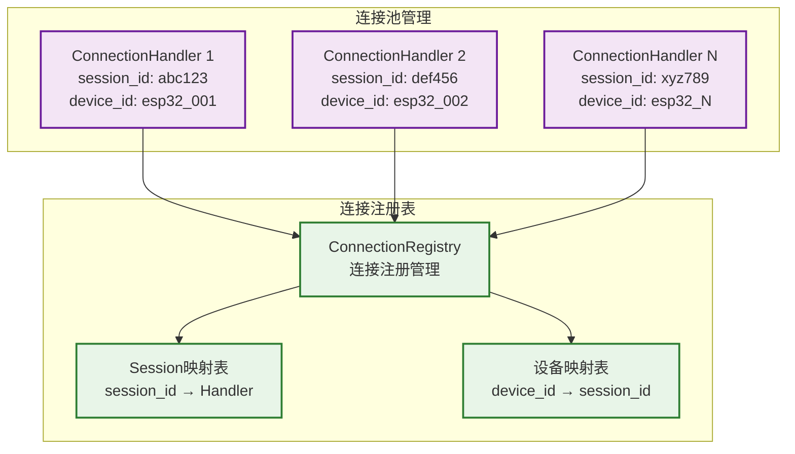
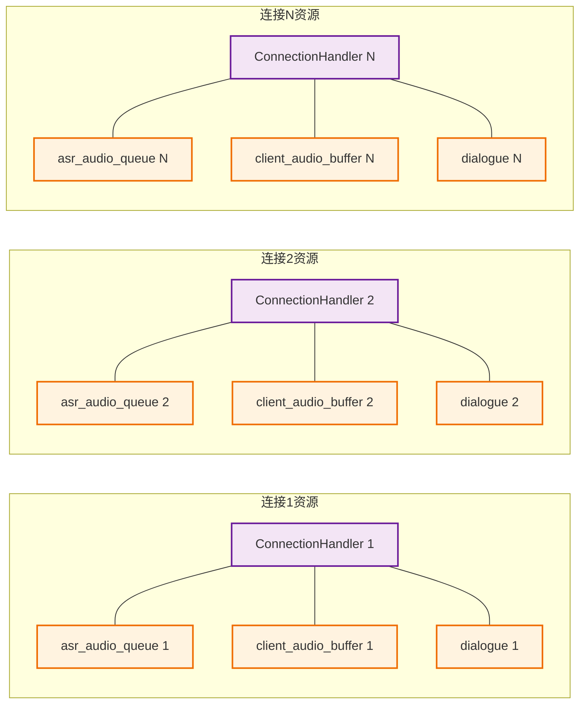
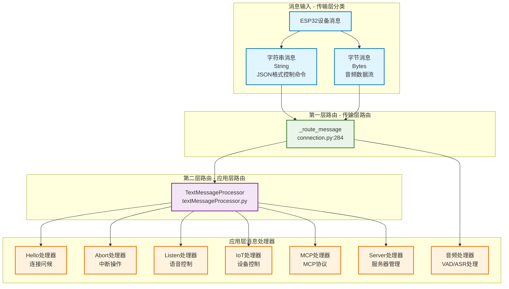
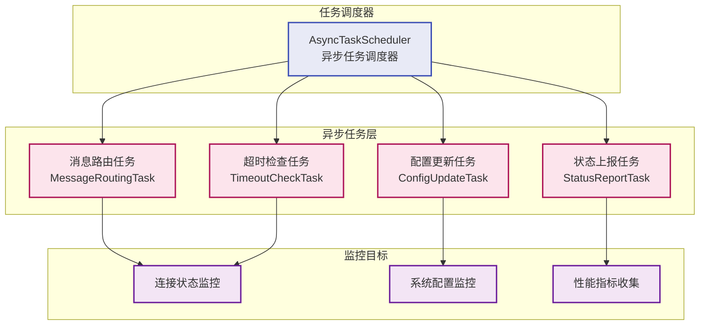
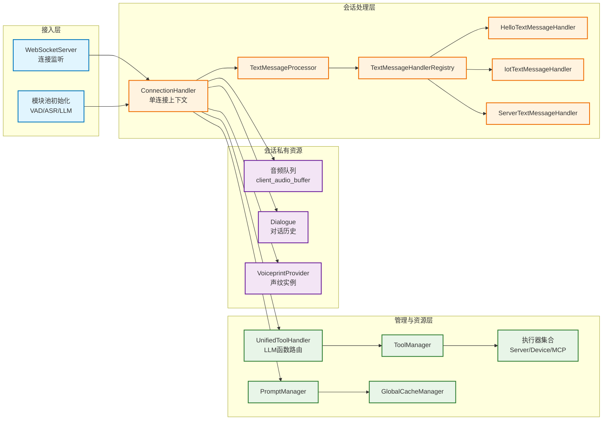
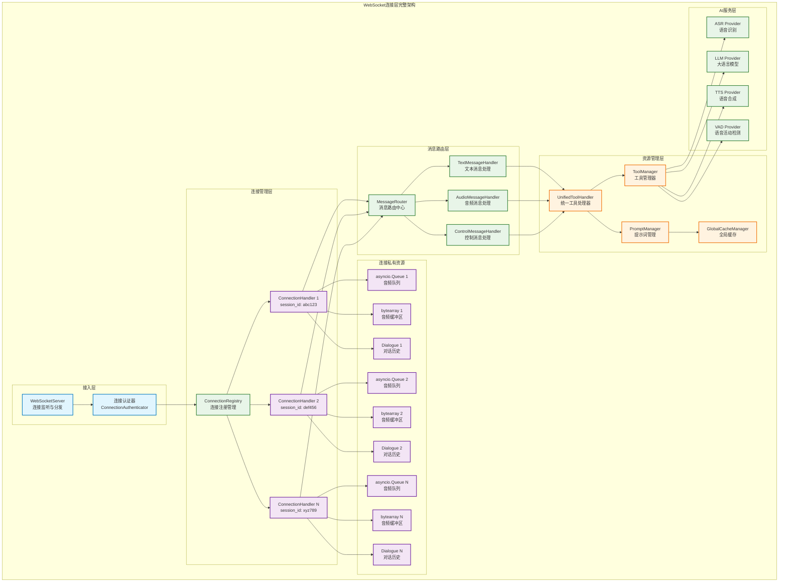
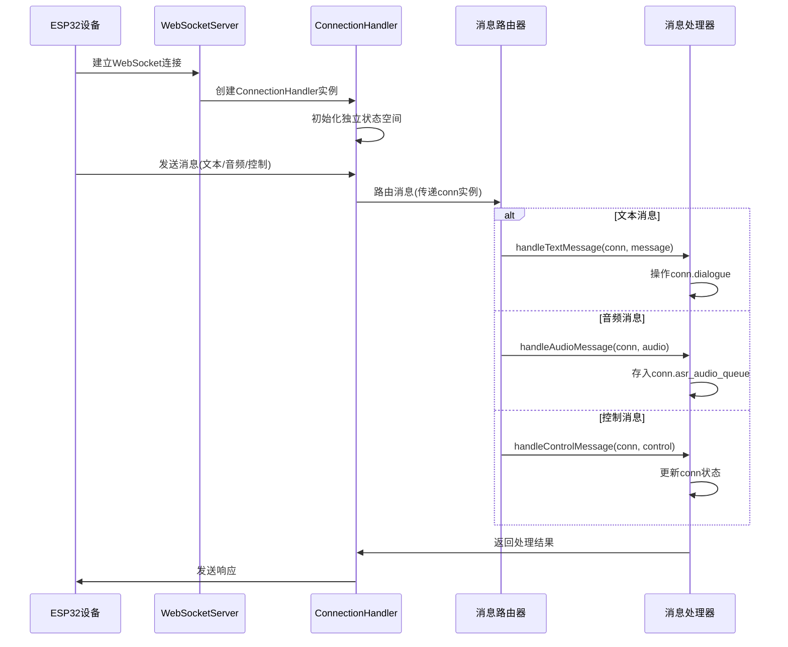
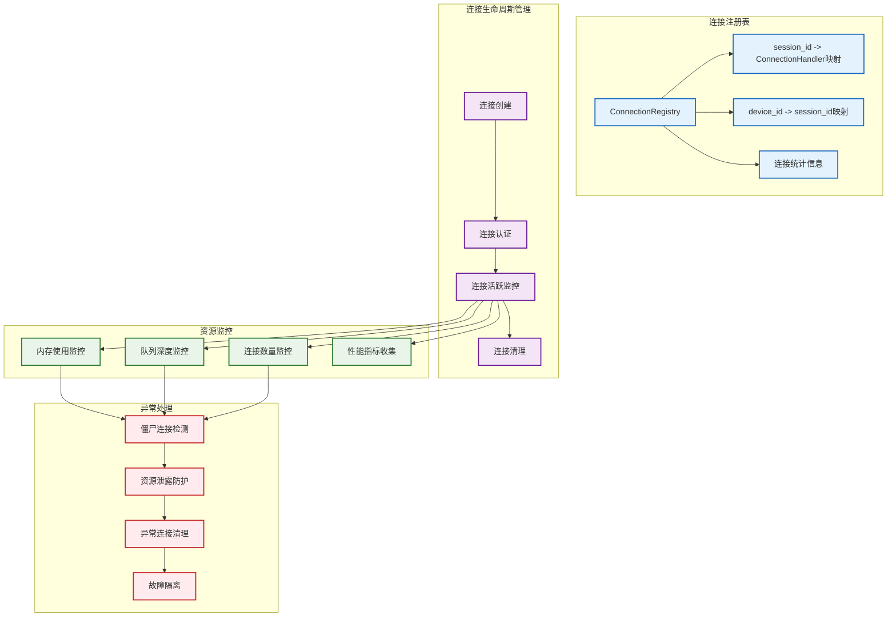

# 连接管理与消息路由架构

> **说明：** 详细展示WebSocket连接管理和高并发消息路由机制的架构设计。

## WebSocket连接层架构（拆分）

> **说明：** 将大型架构图拆分为多个独立的子图，便于理解和展示各个组件的职责。

### 1. WebSocket服务器核心组件



### 2. 连接池管理结构



### 3. 连接独立资源配置



### 4. 消息路由机制

系统采用两层消息路由架构，实现传输层和应用层的分离：



**消息处理流程**：

1. **第一层路由**（`connection.py:_route_message`）：
   - 字符串消息 → 转发到 `handleTextMessage()`
   - 字节消息 → 转发到音频处理队列

2. **第二层路由**（`textMessageProcessor.py`）：
   - 解析JSON消息的 `type` 字段
   - 路由到对应的应用层处理器

3. **支持的消息类型**：
   - `hello`: 连接建立和身份验证
   - `abort`: 中断当前对话或操作
   - `listen`: 语音拾音状态控制（start/stop/detect）
   - `iot`: IoT设备控制命令
   - `mcp`: MCP协议通信
   - `server`: 服务器管理（重启、配置更新）

### 5. 异步任务管理层



### 6. Handler/Manager 协作视图



> **理解要点：** 连接级 Handler 负责调度流程和维持会话状态，Manager 则集中承载共享资源（执行器、缓存、提示词等），两者通过清晰的接口解耦，便于扩展和故障隔离。

## WebSocket连接层架构（完整概览）



> **完整架构说明：** 该架构图展示了WebSocket连接层的完整体系结构，从连接接入、消息路由到资源管理和AI服务集成的全流程。每个ConnectionHandler维护独立的异步资源队列，确保高并发场景下的性能和稳定性。

## 高并发连接架构设计

### 1. 连接状态隔离机制

每个 `ConnectionHandler` 实例维护完全独立的状态空间：

```python
class ConnectionHandler:
    def __init__(self):
        # 连接唯一标识
        self.session_id = str(uuid.uuid4())  # 唯一会话ID
        self.device_id = None               # 设备ID
        self.client_ip = None               # 客户端IP

        # 连接级别的队列和缓冲区
        self.asr_audio_queue = asyncio.Queue()    # 每个连接独立的异步音频队列
        self.client_audio_buffer = bytearray()    # 每个连接独立的音频缓冲区
        self.dialogue = Dialogue()               # 每个连接独立的对话历史

        # 连接状态管理
        self.websocket = None               # WebSocket连接实例
        self.stop_event = asyncio.Event()   # 停止信号
        self.last_activity = time.time()    # 最后活动时间
```

### 2. 消息路由机制



### 3. 连接池管理架构



## 消息路由核心机制

### 1. 消息类型识别与分发

```python
async def _route_message(self, message):
    """消息路由核心逻辑"""
    try:
        if isinstance(message, str):
            # 文本消息处理
            await self._handle_text_message(message)
        elif isinstance(message, bytes):
            # 音频消息处理
            await self._handle_audio_message(message)
        elif isinstance(message, dict):
            # JSON控制消息处理  
            await self._handle_control_message(message)
        else:
            logger.warning(f"未知消息类型: {type(message)}")
            
    except Exception as e:
        logger.error(f"消息路由异常: {e}")
        await self._handle_routing_error(e)
```

### 2. 连接上下文传递

```python
async def handleTextMessage(conn, message):
    """文本消息处理 - 连接上下文传递"""
    # 获取连接特定的状态
    device_id = conn.device_id
    session_id = conn.session_id
    websocket = conn.websocket
    
    # 操作连接独立的对话历史
    conn.dialogue.add_message("user", message)
    
    # 基于连接状态进行处理
    response = await process_user_input(conn, message)
    
    # 通过连接实例发送响应
    await conn.send_message(response)

async def handleAudioMessage(conn, audio_data):
    """音频消息处理 - 连接隔离"""
    # 存入连接专属的音频队列（异步操作）
    await conn.asr_audio_queue.put(audio_data)

    # 基于连接状态进行VAD检测
    have_voice = conn.vad.is_vad(conn, audio_data)

    if have_voice:
        # 添加到连接专属的音频缓冲区
        conn.client_audio_buffer.extend(audio_data)
```

## 并发处理优势

### 1. 状态隔离优势
- **完全独立**：每个连接的状态完全隔离，无共享状态
- **故障隔离**：单个连接出错不会影响其他连接
- **配置独立**：每个连接可以有不同的AI服务配置

### 2. 资源独立优势
- **队列独立**：每个连接有独立的消息队列
- **缓冲独立**：音频缓冲区按连接隔离
- **历史独立**：对话历史按会话管理

### 3. 扩展性优势
- **线性扩展**：连接数增加不影响现有连接性能
- **高并发支持**：可轻松支持数千个并发连接
- **动态负载**：根据连接负载动态调整资源

## 性能优化设计

### 1. 异步I/O优化
```python
class OptimizedConnectionHandler:
    def __init__(self):
        # 使用异步队列替代同步队列
        self.message_queue = asyncio.Queue(maxsize=1000)
        self.response_buffer = collections.deque(maxlen=100)
        
    async def process_messages_batch(self):
        """批量处理消息以提升性能"""
        batch = []
        try:
            # 批量收集消息
            while len(batch) < 10:
                message = await asyncio.wait_for(
                    self.message_queue.get(), timeout=0.1
                )
                batch.append(message)
        except asyncio.TimeoutError:
            pass
            
        if batch:
            await self.process_message_batch(batch)
```

### 2. 内存管理优化
```python
class MemoryOptimizedHandler:
    def __init__(self):
        self.max_buffer_size = 5 * 1024 * 1024  # 5MB
        self.max_queue_size = 1000
        self.max_dialogue_length = 50
        
    async def cleanup_resources(self):
        """定期资源清理"""
        # 清理超大音频缓冲
        if len(self.client_audio_buffer) > self.max_buffer_size:
            self.client_audio_buffer = self.client_audio_buffer[-self.max_buffer_size:]
            
        # 清理队列积压 - 丢弃最旧消息，避免替换队列实例
        while self.asr_audio_queue.qsize() > self.max_queue_size:
            try:
                dropped_msg = self.asr_audio_queue.get_nowait()
            except asyncio.QueueEmpty:
                break
            else:
                # 标记被丢弃的任务完成，防止 queue.join() 失真
                self.asr_audio_queue.task_done()
                # 也可以在此处记录 dropped_msg 方便排查
            
        # 清理对话历史
        if len(self.dialogue.dialogue) > self.max_dialogue_length:
            self.dialogue.dialogue = self.dialogue.dialogue[-self.max_dialogue_length:]
```

## 监控与告警

### 1. 关键指标监控
- **连接数量**：当前活跃连接数、新增连接率
- **消息吞吐**：每秒处理消息数、消息积压情况  
- **资源使用**：每连接内存占用、队列深度
- **响应延迟**：消息处理延迟分布、P95/P99延迟

### 2. 异常检测与处理
- **僵尸连接检测**：超时无响应连接自动清理
- **资源泄露防护**：内存/队列溢出保护机制
- **连接异常隔离**：异常连接不影响其他连接
- **自动恢复机制**：连接断开后的自动重连支持

---

📋 **相关文档导航：**
- [01_系统总体架构](01_system_overview.md) - 系统整体架构概览
- [03_AI服务集成架构](03_ai_services_integration.md) - AI服务层集成方式
- [06_生命周期管理架构](06_lifecycle_management.md) - 连接生命周期详细管理

*图表创建时间：2025-08-24*
