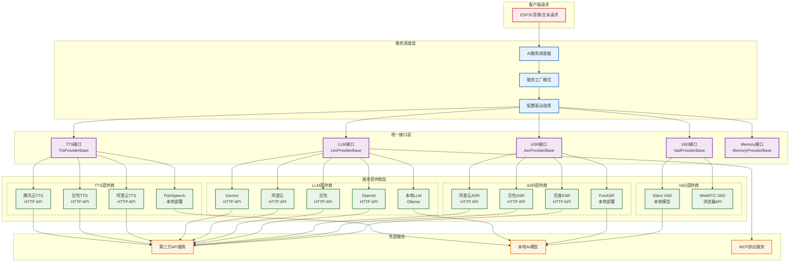
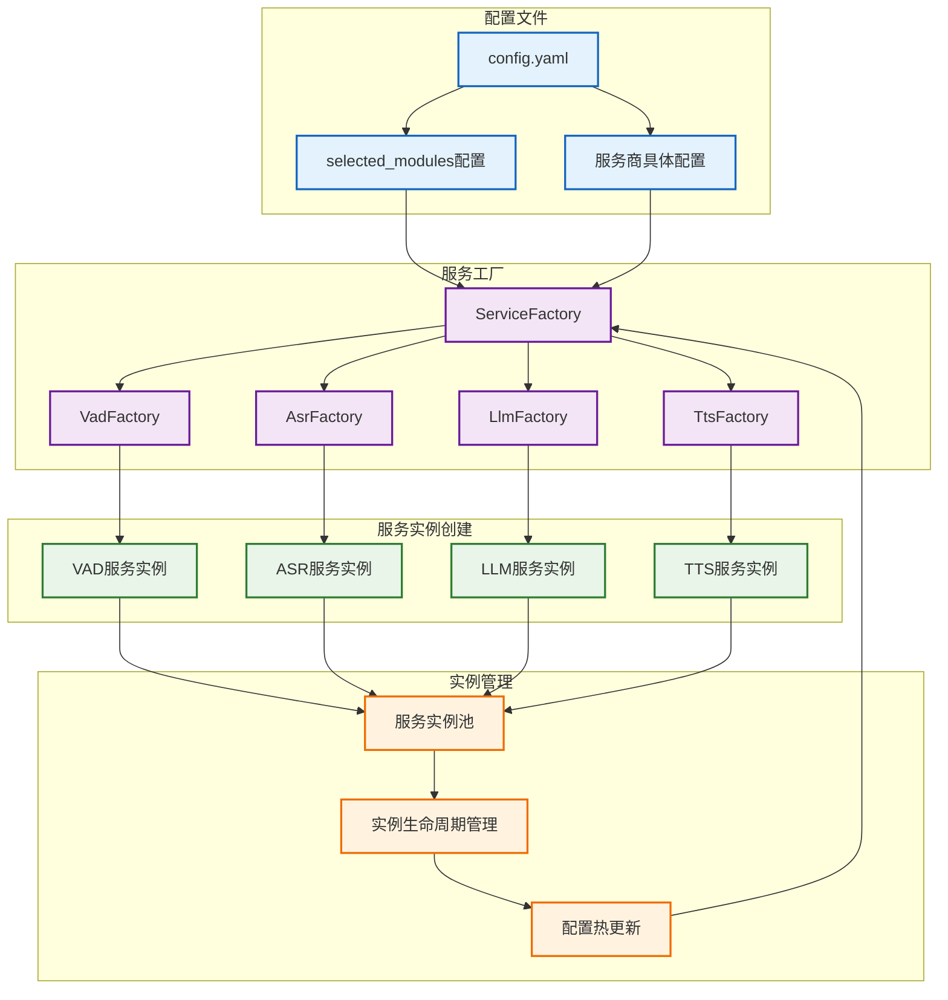
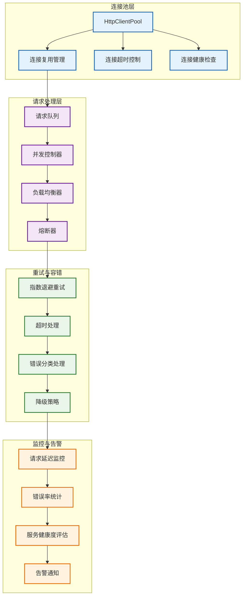

# AI服务集成架构

> **说明：** 详细展示AI服务模块的集成方式、提供商管理和统一接口设计。

## AI服务集成总览



## 统一接口设计

### 1. 服务基类定义

```python
from abc import ABC, abstractmethod

class VadProviderBase(ABC):
    """VAD服务基类"""
    @abstractmethod
    async def is_speech(self, audio_data: bytes) -> bool:
        """检测音频中是否包含语音"""
        pass

class AsrProviderBase(ABC):
    """ASR服务基类"""
    @abstractmethod
    async def speech_to_text(self, audio_data: bytes) -> str:
        """语音转文本"""
        pass
    
    @abstractmethod
    async def stream_speech_to_text(self, audio_stream) -> AsyncIterator[str]:
        """流式语音识别"""
        pass

class LlmProviderBase(ABC):
    """LLM服务基类"""
    @abstractmethod
    async def chat_completion(self, messages: List[dict]) -> str:
        """对话补全"""
        pass
    
    @abstractmethod
    async def stream_chat_completion(self, messages: List[dict]) -> AsyncIterator[str]:
        """流式对话补全"""
        pass

class TtsProviderBase(ABC):
    """TTS服务基类"""
    @abstractmethod
    async def text_to_speech(self, text: str, voice: str = None) -> bytes:
        """文本转语音"""
        pass
    
    @abstractmethod
    async def get_available_voices(self) -> List[dict]:
        """获取可用语音列表"""
        pass
```

## 服务工厂与配置驱动

### 1. 服务工厂模式



### 2. 配置驱动实现

```python
class ServiceFactory:
    def __init__(self, config: dict):
        self.config = config
        self.service_instances = {}
        
    async def create_vad_service(self) -> VadProviderBase:
        """根据配置创建VAD服务"""
        provider = self.config['selected_modules']['VAD']
        
        if provider == 'silero':
            from providers.vad.silero import SileroVadProvider
            return SileroVadProvider(self.config['VAD']['silero'])
        elif provider == 'webrtc':
            from providers.vad.webrtc import WebRtcVadProvider
            return WebRtcVadProvider(self.config['VAD']['webrtc'])
        else:
            raise ValueError(f"Unsupported VAD provider: {provider}")
    
    async def create_asr_service(self) -> AsrProviderBase:
        """根据配置创建ASR服务"""
        provider = self.config['selected_modules']['ASR']
        
        provider_map = {
            'funasr': 'providers.asr.funasr.FunAsrProvider',
            'baidu': 'providers.asr.baidu.BaiduAsrProvider',
            'doubao': 'providers.asr.doubao.DoubaoAsrProvider',
            'aliyun': 'providers.asr.aliyun.AliyunAsrProvider'
        }
        
        if provider in provider_map:
            module_path = provider_map[provider]
            module_name, class_name = module_path.rsplit('.', 1)
            module = __import__(module_name, fromlist=[class_name])
            provider_class = getattr(module, class_name)
            return provider_class(self.config['ASR'][provider])
        else:
            raise ValueError(f"Unsupported ASR provider: {provider}")
```

## 集成方式分类

### 1. HTTP API集成方式

```python
class HttpApiProvider:
    """HTTP API集成基类"""
    def __init__(self, config: dict):
        self.config = config
        self.session = None
        self.base_url = config.get('base_url')
        self.api_key = config.get('api_key')
        
    async def __aenter__(self):
        import aiohttp
        timeout = aiohttp.ClientTimeout(total=30)
        connector = aiohttp.TCPConnector(limit=100)
        self.session = aiohttp.ClientSession(
            timeout=timeout, 
            connector=connector,
            headers={'Authorization': f'Bearer {self.api_key}'}
        )
        return self
        
    async def __aexit__(self, exc_type, exc_val, exc_tb):
        if self.session:
            await self.session.close()
    
    async def make_request(self, endpoint: str, data: dict) -> dict:
        """统一的HTTP请求方法"""
        url = f"{self.base_url}/{endpoint}"
        
        for attempt in range(3):  # 重试机制
            try:
                async with self.session.post(url, json=data) as response:
                    response.raise_for_status()
                    return await response.json()
            except Exception as e:
                if attempt == 2:  # 最后一次重试
                    raise
                await asyncio.sleep(2 ** attempt)  # 指数退避
```

### 2. 本地模型集成方式

```python
class LocalModelProvider:
    """本地模型集成基类"""
    def __init__(self, config: dict):
        self.config = config
        self.model = None
        self.model_path = config.get('model_path')
        
    async def load_model(self):
        """异步加载模型"""
        import torch
        
        # 在线程池中加载模型以避免阻塞
        loop = asyncio.get_event_loop()
        executor = ThreadPoolExecutor(max_workers=1)
        
        def _load_model():
            if self.model_path.endswith('.onnx'):
                import onnxruntime as ort
                return ort.InferenceSession(self.model_path)
            elif self.model_path.endswith('.pth'):
                return torch.load(self.model_path)
            else:
                return torch.hub.load('snakers4/silero-vad', 'silero_vad')
        
        self.model = await loop.run_in_executor(executor, _load_model)
        
    async def inference(self, input_data):
        """异步推理"""
        if not self.model:
            await self.load_model()
            
        loop = asyncio.get_event_loop()
        executor = ThreadPoolExecutor(max_workers=2)
        
        def _inference():
            # 具体的推理逻辑
            return self.model(input_data)
            
        return await loop.run_in_executor(executor, _inference)
```

### 3. MCP协议集成方式

```python
class McpProvider:
    """MCP协议集成基类"""
    def __init__(self, config: dict):
        self.config = config
        self.client = None
        self.transport = None
        
    async def connect(self):
        """连接MCP服务"""
        from mcp.client.stdio import StdioServerSession
        from mcp.client.session import ClientSession
        
        if self.config.get('transport_type') == 'stdio':
            self.transport = StdioServerSession(
                self.config['server_command'],
                self.config.get('server_args', [])
            )
        
        self.client = ClientSession(self.transport)
        await self.client.initialize()
        
    async def call_tool(self, tool_name: str, arguments: dict):
        """调用MCP工具"""
        if not self.client:
            await self.connect()
            
        result = await self.client.call_tool(tool_name, arguments)
        return result
```

## 异步处理优化

### 1. 连接池管理



### 2. 性能优化策略

```python
class OptimizedAiServiceManager:
    def __init__(self):
        # 连接池配置
        self.http_pools = {}
        self.max_connections = 100
        self.connection_timeout = 10
        
        # 并发控制
        self.semaphores = {
            'llm': asyncio.Semaphore(5),    # LLM并发限制
            'asr': asyncio.Semaphore(10),   # ASR并发限制  
            'tts': asyncio.Semaphore(8),    # TTS并发限制
        }
        
        # 缓存策略
        self.response_cache = {}
        self.cache_ttl = 300  # 5分钟缓存
        
    async def create_http_pool(self, provider: str) -> aiohttp.ClientSession:
        """为每个服务提供商创建HTTP连接池"""
        if provider not in self.http_pools:
            timeout = aiohttp.ClientTimeout(total=self.connection_timeout)
            connector = aiohttp.TCPConnector(
                limit=self.max_connections,
                limit_per_host=20,
                keepalive_timeout=60
            )
            
            self.http_pools[provider] = aiohttp.ClientSession(
                timeout=timeout,
                connector=connector
            )
            
        return self.http_pools[provider]
    
    async def call_ai_service_with_cache(self, service_type: str, cache_key: str, 
                                       service_func, *args, **kwargs):
        """带缓存的AI服务调用"""
        # 检查缓存
        cached_result = self.response_cache.get(cache_key)
        if cached_result and time.time() - cached_result['timestamp'] < self.cache_ttl:
            return cached_result['data']
        
        # 并发控制
        async with self.semaphores.get(service_type, asyncio.Semaphore(5)):
            try:
                result = await service_func(*args, **kwargs)
                
                # 缓存结果
                self.response_cache[cache_key] = {
                    'data': result,
                    'timestamp': time.time()
                }
                
                return result
                
            except Exception as e:
                # 错误处理和降级
                return await self.handle_service_error(service_type, e)
    
    async def handle_service_error(self, service_type: str, error: Exception):
        """服务错误处理和降级策略"""
        if isinstance(error, aiohttp.ClientTimeout):
            return f"[{service_type}超时] 服务暂时不可用，请稍后重试"
        elif isinstance(error, aiohttp.ClientResponseError):
            if error.status == 429:  # 限流
                await asyncio.sleep(1)  # 等待后重试
                return "[服务限流] 请求过于频繁，正在重试"
            else:
                return f"[{service_type}错误] 服务返回错误: {error.status}"
        else:
            return f"[{service_type}异常] 服务异常，使用离线模式"
```

## 服务监控与管理

### 1. 服务健康检查

```python
class ServiceHealthMonitor:
    def __init__(self):
        self.health_status = {}
        self.error_counts = {}
        self.last_check_time = {}
        
    async def check_service_health(self, service_type: str, provider: str):
        """检查服务健康状态"""
        try:
            # 发送健康检查请求
            start_time = time.time()
            
            if service_type == 'llm':
                result = await self.health_check_llm(provider)
            elif service_type == 'asr':
                result = await self.health_check_asr(provider)
            elif service_type == 'tts':
                result = await self.health_check_tts(provider)
            
            latency = time.time() - start_time
            
            # 更新健康状态
            self.health_status[f"{service_type}_{provider}"] = {
                'status': 'healthy',
                'latency': latency,
                'last_check': time.time(),
                'error_count': 0
            }
            
        except Exception as e:
            # 记录错误
            key = f"{service_type}_{provider}"
            self.error_counts[key] = self.error_counts.get(key, 0) + 1
            
            self.health_status[key] = {
                'status': 'unhealthy',
                'error': str(e),
                'last_check': time.time(),
                'error_count': self.error_counts[key]
            }
```

---

📋 **相关文档导航：**
- [01_系统总体架构](01_system_overview.md) - 系统整体架构概览
- [02_连接管理架构](02_connection_management.md) - 连接处理层详细设计
- [04_数据流处理架构](04_data_flow.md) - 数据流向和处理流程

*图表创建时间：2025-08-24*
