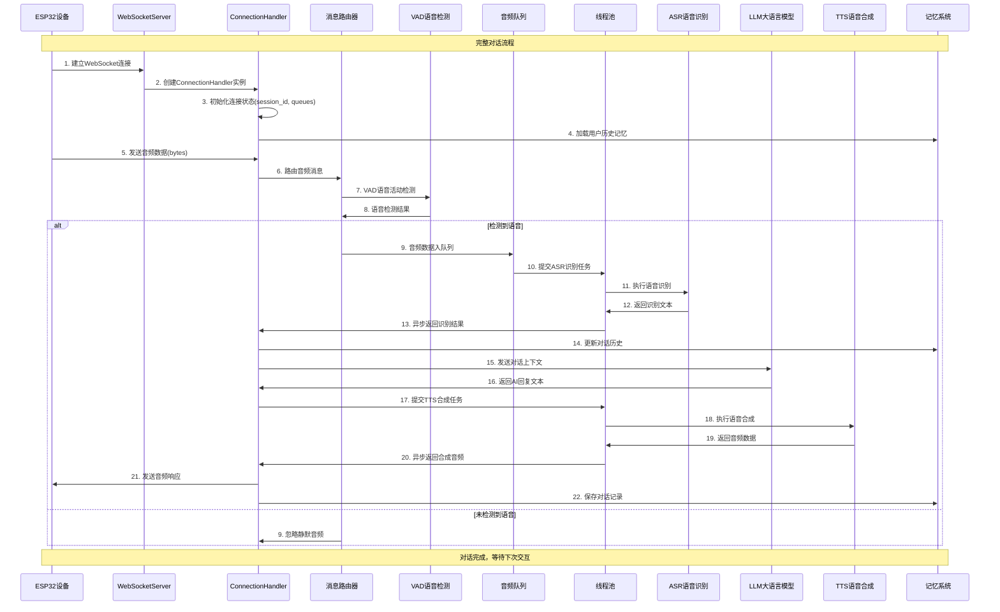
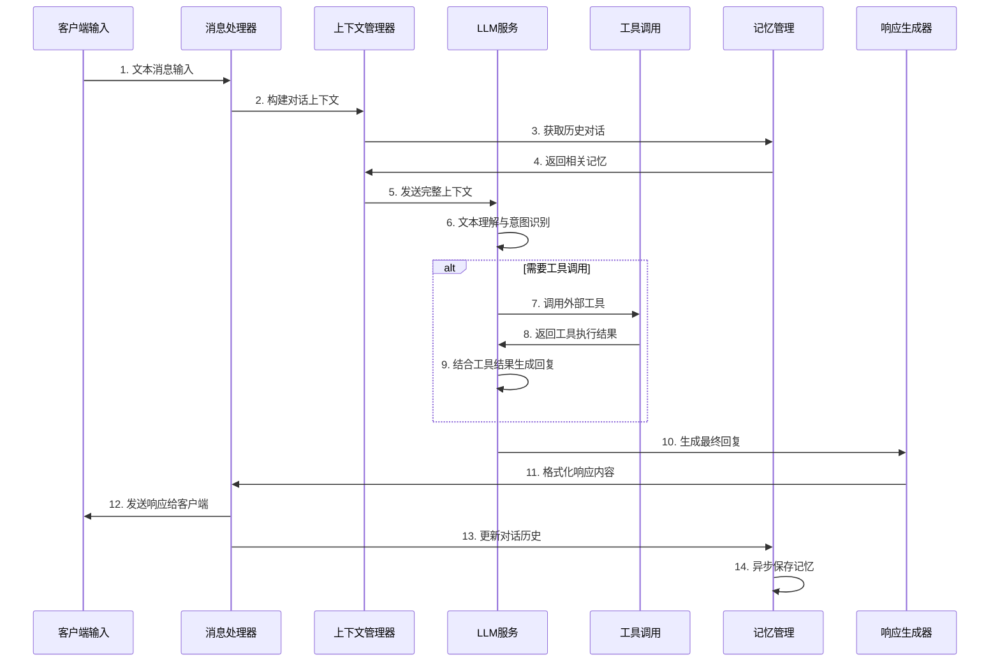
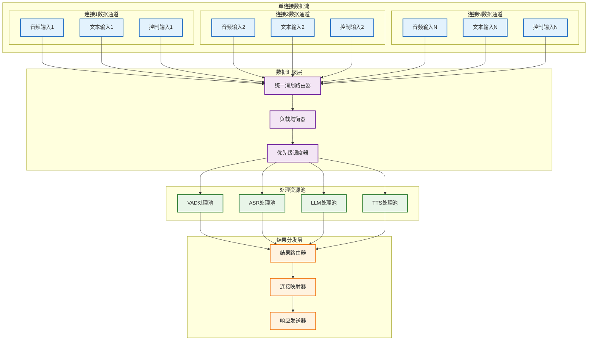
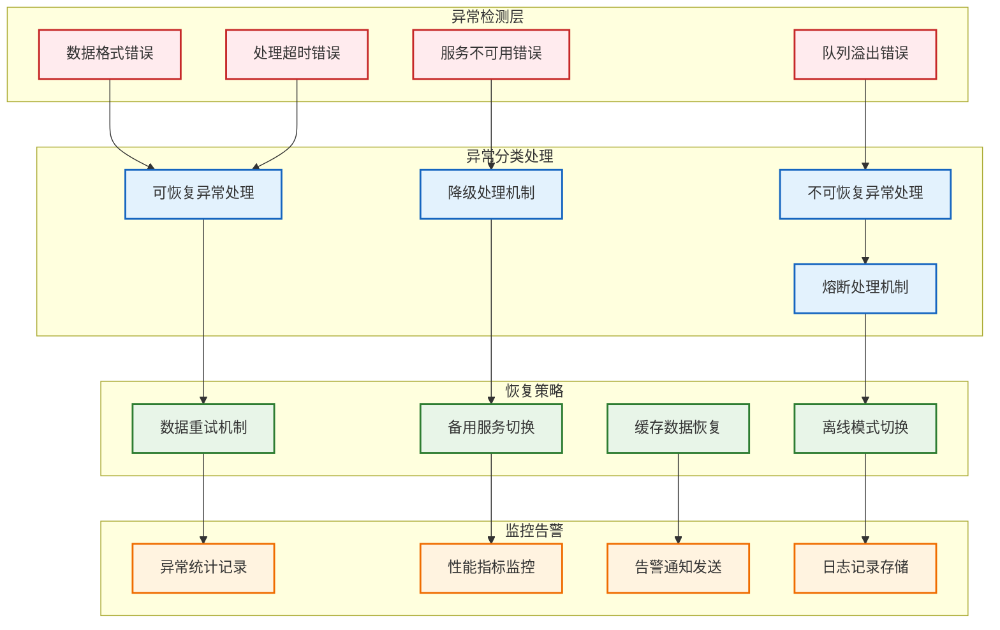

# 数据流处理架构

> **说明：** 详细展示从ESP32设备到AI处理再到响应的完整数据流向和处理流程。

## 完整数据流序列图



## 音频数据流处理架构

```mermaid
graph TB
    subgraph "音频输入层"
        A[ESP32麦克风采集]
        B[音频编码PCM]
        C[WebSocket传输]
    end
    
    subgraph "音频预处理层"
        D[音频数据接收]
        E[格式验证]
        F[音频缓冲区管理]
    end
    
    subgraph "语音检测层"
        G[VAD实时检测]
        H[语音段分割]
        I[静音过滤]
    end
    
    subgraph "队列管理层"
        J[音频数据队列]
        K[队列优先级管理]
        L[缓冲区溢出保护]
    end
    
    subgraph "异步处理层"
        M[线程池任务分发]
        N[ASR任务执行]
        O[并发控制]
    end
    
    subgraph "结果处理层"
        P[识别结果收集]
        Q[文本后处理]
        R[结果异步回调]
    end
    
    %% 数据流向
    A --> B
    B --> C
    C --> D
    D --> E
    E --> F
    
    F --> G
    G --> H
    H --> I
    
    I --> J
    J --> K
    K --> L
    
    L --> M
    M --> N
    N --> O
    
    O --> P
    P --> Q
    Q --> R
    
    %% 样式定义
    classDef input fill:#ffebee,stroke:#c62828,stroke-width:2px
    classDef preprocess fill:#e3f2fd,stroke:#1565c0,stroke-width:2px
    classDef detection fill:#f3e5f5,stroke:#6a1b9a,stroke-width:2px
    classDef queue fill:#e8f5e8,stroke:#2e7d32,stroke-width:2px
    classDef async fill:#fff3e0,stroke:#ef6c00,stroke-width:2px
    classDef result fill:#e0f2f1,stroke:#00695c,stroke-width:2px
    
    class A,B,C input
    class D,E,F preprocess
    class G,H,I detection
    class J,K,L queue
    class M,N,O async
    class P,Q,R result
```



## 文本处理数据流



## 并发数据处理模型



## 数据队列与缓冲管理

### 1. 音频数据队列

```python
class AudioDataQueue:
    def __init__(self, maxsize: int = 1000):
        self.queue = asyncio.Queue(maxsize=maxsize)
        self.buffer = bytearray()
        self.max_buffer_size = 5 * 1024 * 1024  # 5MB
        self.stats = {
            'total_received': 0,
            'total_processed': 0,
            'queue_overflows': 0
        }
    
    async def put_audio_data(self, audio_data: bytes):
        """添加音频数据到队列"""
        try:
            # 检查缓冲区大小
            if len(self.buffer) + len(audio_data) > self.max_buffer_size:
                # 清理旧数据，保留最新的50%
                keep_size = self.max_buffer_size // 2
                self.buffer = self.buffer[-keep_size:]
            
            self.buffer.extend(audio_data)
            await self.queue.put(audio_data)
            self.stats['total_received'] += len(audio_data)
            
        except asyncio.QueueFull:
            # 队列满时的处理策略
            self.stats['queue_overflows'] += 1
            # 丢弃最旧的数据
            try:
                self.queue.get_nowait()
                await self.queue.put(audio_data)
            except asyncio.QueueEmpty:
                pass
    
    async def get_audio_batch(self, batch_size: int = 10) -> List[bytes]:
        """批量获取音频数据"""
        batch = []
        try:
            # 获取第一个数据项
            first_item = await asyncio.wait_for(self.queue.get(), timeout=1.0)
            batch.append(first_item)
            
            # 尝试获取更多数据项以组成批次
            for _ in range(batch_size - 1):
                try:
                    item = self.queue.get_nowait()
                    batch.append(item)
                except asyncio.QueueEmpty:
                    break
                    
        except asyncio.TimeoutError:
            pass
            
        self.stats['total_processed'] += len(batch)
        return batch
```

### 2. 响应数据流管理

```python
class ResponseStream:
    def __init__(self, connection_id: str):
        self.connection_id = connection_id
        self.response_queue = asyncio.Queue()
        self.is_streaming = False
        self.stream_buffer = []
        
    async def start_streaming(self):
        """开始流式响应"""
        self.is_streaming = True
        
    async def add_chunk(self, chunk: str):
        """添加响应块"""
        if self.is_streaming:
            await self.response_queue.put(chunk)
        else:
            self.stream_buffer.append(chunk)
    
    async def get_response_chunks(self):
        """获取响应流"""
        # 先发送缓冲的数据
        for chunk in self.stream_buffer:
            yield chunk
        self.stream_buffer.clear()
        
        # 然后发送流式数据
        while self.is_streaming:
            try:
                chunk = await asyncio.wait_for(
                    self.response_queue.get(), 
                    timeout=0.1
                )
                yield chunk
            except asyncio.TimeoutError:
                continue
            except asyncio.CancelledError:
                break
    
    async def end_streaming(self):
        """结束流式响应"""
        self.is_streaming = False
        await self.response_queue.put(None)  # 发送结束标记
```

## 错误处理与数据恢复

### 1. 数据流异常处理



### 2. 数据一致性保障

```python
class DataConsistencyManager:
    def __init__(self):
        self.transaction_log = []
        self.checkpoint_data = {}
        self.recovery_points = {}
        
    async def create_checkpoint(self, connection_id: str, data_state: dict):
        """创建数据检查点"""
        checkpoint = {
            'timestamp': time.time(),
            'connection_id': connection_id,
            'state': copy.deepcopy(data_state),
            'sequence_number': len(self.transaction_log)
        }
        
        self.checkpoint_data[connection_id] = checkpoint
        self.recovery_points[connection_id] = checkpoint
        
    async def log_transaction(self, connection_id: str, operation: str, data: dict):
        """记录数据变更事务"""
        transaction = {
            'timestamp': time.time(),
            'connection_id': connection_id,
            'operation': operation,
            'data': data,
            'sequence_number': len(self.transaction_log)
        }
        
        self.transaction_log.append(transaction)
        
    async def recover_data(self, connection_id: str) -> dict:
        """恢复连接数据状态"""
        recovery_point = self.recovery_points.get(connection_id)
        if not recovery_point:
            return {}
        
        # 从恢复点开始重放事务
        recovered_state = copy.deepcopy(recovery_point['state'])
        start_sequence = recovery_point['sequence_number']
        
        for transaction in self.transaction_log[start_sequence:]:
            if transaction['connection_id'] == connection_id:
                recovered_state = self.apply_transaction(recovered_state, transaction)
        
        return recovered_state
    
    def apply_transaction(self, state: dict, transaction: dict) -> dict:
        """应用事务到状态"""
        operation = transaction['operation']
        data = transaction['data']
        
        if operation == 'update_dialogue':
            state['dialogue'] = state.get('dialogue', [])
            state['dialogue'].append(data)
        elif operation == 'update_buffer':
            state['audio_buffer'] = data.get('buffer', bytearray())
        # 添加更多操作类型...
        
        return state
```

## 性能监控与优化

### 1. 数据流性能指标

```python
class DataFlowMetrics:
    def __init__(self):
        self.metrics = {
            'audio_processing_latency': [],
            'text_processing_latency': [],
            'queue_depth': [],
            'throughput': [],
            'error_rate': 0,
            'success_rate': 0
        }
        
    def record_latency(self, operation: str, latency: float):
        """记录处理延迟"""
        if operation in self.metrics:
            self.metrics[operation].append(latency)
            # 只保留最近1000条记录
            if len(self.metrics[operation]) > 1000:
                self.metrics[operation] = self.metrics[operation][-1000:]
    
    def get_percentile(self, operation: str, percentile: float) -> float:
        """获取延迟百分位数"""
        latencies = self.metrics.get(operation, [])
        if not latencies:
            return 0
        
        sorted_latencies = sorted(latencies)
        index = int(len(sorted_latencies) * percentile / 100)
        return sorted_latencies[index] if index < len(sorted_latencies) else 0
    
    def get_average_latency(self, operation: str) -> float:
        """获取平均延迟"""
        latencies = self.metrics.get(operation, [])
        return sum(latencies) / len(latencies) if latencies else 0
```

---

📋 **相关文档导航：**
- [01_系统总体架构](01_system_overview.md) - 系统整体架构概览
- [02_连接管理架构](02_connection_management.md) - 连接处理层详细设计
- [03_AI服务集成架构](03_ai_services_integration.md) - AI服务层集成方式
- [05_并发处理架构](05_concurrency_model.md) - 并发处理模型

*图表创建时间：2025-08-24*
