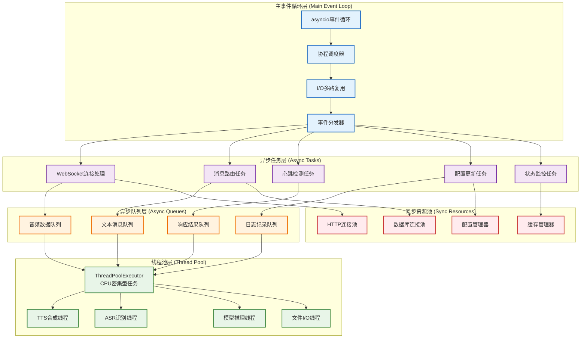
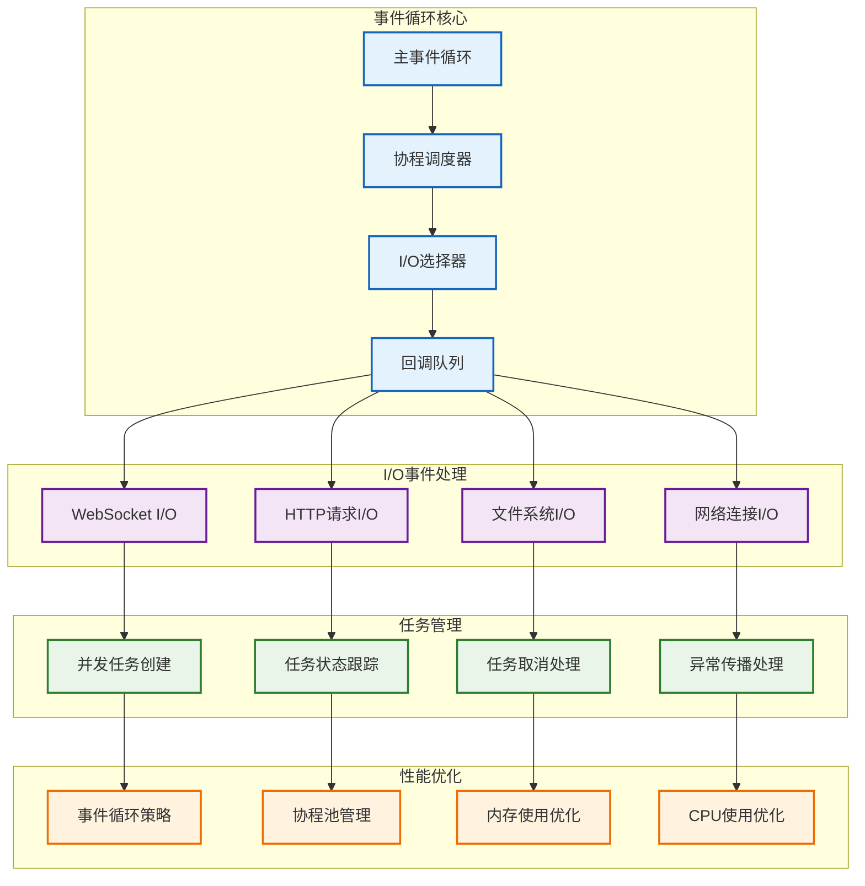
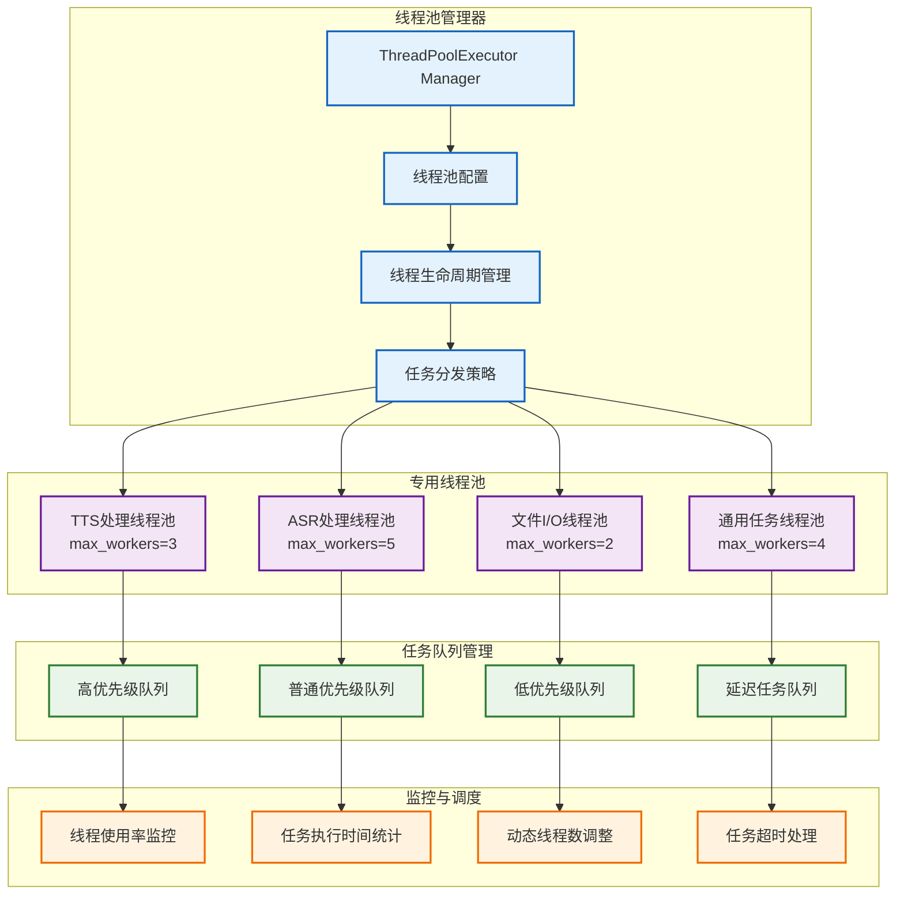
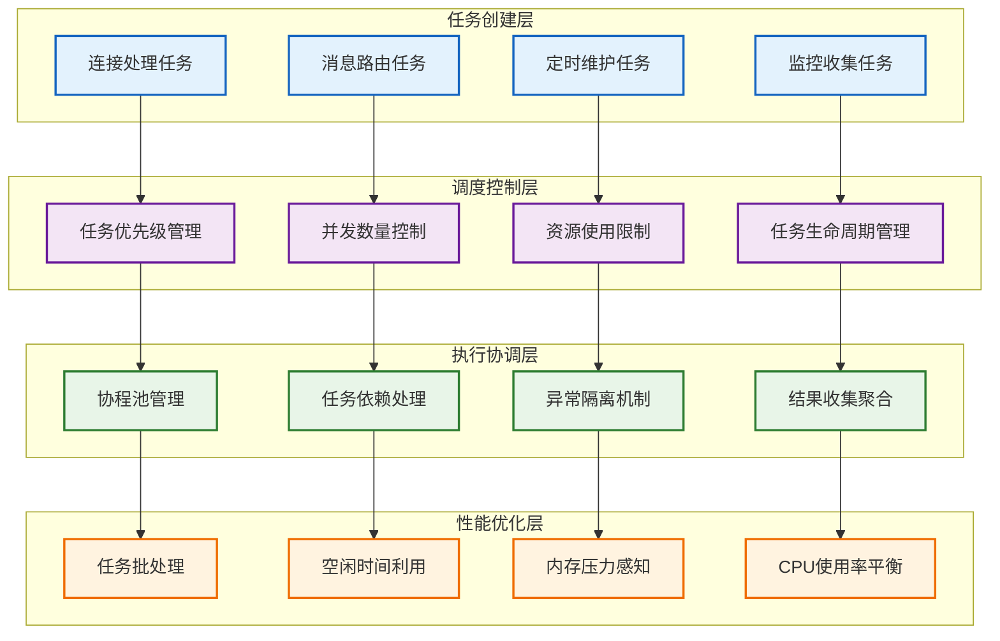

# 并发处理架构模型

> **说明：** 详细展示事件循环、线程池和异步任务的并发处理模型设计。

## 并发处理总体架构



## 异步事件循环设计

### 1. 事件循环核心机制



### 2. 事件循环优化实现

```python
import asyncio
import uvloop  # Linux下的高性能事件循环
import sys

class OptimizedEventLoop:
    def __init__(self):
        self.loop = None
        self.tasks = set()
        self.background_tasks = set()
        
    def setup_event_loop(self):
        """设置优化的事件循环"""
        if sys.platform == 'linux':
            # Linux使用uvloop提升性能
            uvloop.install()
        elif sys.platform == 'win32':
            # Windows使用Proactor事件循环
            asyncio.set_event_loop_policy(asyncio.WindowsProactorEventLoopPolicy())
            
        self.loop = asyncio.new_event_loop()
        asyncio.set_event_loop(self.loop)
        
        # 设置事件循环参数
        self.loop.set_debug(False)  # 生产环境关闭调试
        
    async def create_task_with_tracking(self, coro, name=None):
        """创建可追踪的任务"""
        task = asyncio.create_task(coro, name=name)
        self.tasks.add(task)
        
        # 任务完成时从集合中移除
        task.add_done_callback(self.tasks.discard)
        
        return task
    
    async def create_background_task(self, coro, name=None):
        """创建后台任务"""
        task = asyncio.create_task(coro, name=name)
        self.background_tasks.add(task)
        
        task.add_done_callback(self.background_tasks.discard)
        
        return task
    
    async def graceful_shutdown(self):
        """优雅关闭事件循环"""
        # 取消所有任务
        for task in self.tasks.copy():
            if not task.done():
                task.cancel()
        
        for task in self.background_tasks.copy():
            if not task.done():
                task.cancel()
        
        # 等待任务完成
        if self.tasks or self.background_tasks:
            await asyncio.gather(
                *self.tasks, 
                *self.background_tasks, 
                return_exceptions=True
            )
```

## 线程池并发模型

### 1. 线程池架构设计



### 2. 线程池实现

```python
from concurrent.futures import ThreadPoolExecutor
import threading
import time
from typing import Callable, Any
from enum import Enum

class TaskPriority(Enum):
    HIGH = 1
    NORMAL = 2
    LOW = 3

class SmartThreadPoolManager:
    def __init__(self):
        self.pools = {
            'tts': ThreadPoolExecutor(max_workers=3, thread_name_prefix='tts'),
            'asr': ThreadPoolExecutor(max_workers=5, thread_name_prefix='asr'),
            'file_io': ThreadPoolExecutor(max_workers=2, thread_name_prefix='file_io'),
            'general': ThreadPoolExecutor(max_workers=4, thread_name_prefix='general')
        }
        
        self.task_queues = {
            TaskPriority.HIGH: asyncio.Queue(maxsize=100),
            TaskPriority.NORMAL: asyncio.Queue(maxsize=500),
            TaskPriority.LOW: asyncio.Queue(maxsize=1000)
        }
        
        self.stats = {
            'tasks_submitted': 0,
            'tasks_completed': 0,
            'tasks_failed': 0,
            'average_execution_time': 0
        }
        
        self.monitoring_task = None
        
    async def submit_task(self, pool_name: str, func: Callable, 
                         *args, priority: TaskPriority = TaskPriority.NORMAL, 
                         timeout: float = None, **kwargs) -> Any:
        """提交任务到指定线程池"""
        if pool_name not in self.pools:
            raise ValueError(f"Unknown pool: {pool_name}")
        
        pool = self.pools[pool_name]
        loop = asyncio.get_event_loop()
        
        start_time = time.time()
        
        try:
            # 提交任务到线程池
            future = pool.submit(func, *args, **kwargs)
            
            # 设置超时
            if timeout:
                future = asyncio.wait_for(
                    loop.run_in_executor(None, future.result), 
                    timeout=timeout
                )
            else:
                future = loop.run_in_executor(None, future.result)
            
            result = await future
            
            # 更新统计信息
            execution_time = time.time() - start_time
            self.update_stats('completed', execution_time)
            
            return result
            
        except Exception as e:
            self.update_stats('failed')
            raise e
    
    def update_stats(self, status: str, execution_time: float = 0):
        """更新线程池统计信息"""
        self.stats['tasks_submitted'] += 1
        
        if status == 'completed':
            self.stats['tasks_completed'] += 1
            # 更新平均执行时间
            current_avg = self.stats['average_execution_time']
            total_completed = self.stats['tasks_completed']
            self.stats['average_execution_time'] = (
                (current_avg * (total_completed - 1) + execution_time) / total_completed
            )
        elif status == 'failed':
            self.stats['tasks_failed'] += 1
    
    async def start_monitoring(self):
        """启动线程池监控"""
        self.monitoring_task = asyncio.create_task(self._monitor_pools())
    
    async def _monitor_pools(self):
        """监控线程池状态"""
        while True:
            try:
                for pool_name, pool in self.pools.items():
                    # 获取线程池状态
                    active_threads = len([t for t in threading.enumerate() 
                                        if t.name.startswith(pool_name)])
                    
                    print(f"Pool {pool_name}: {active_threads} active threads")
                
                await asyncio.sleep(30)  # 每30秒检查一次
                
            except asyncio.CancelledError:
                break
            except Exception as e:
                print(f"Monitoring error: {e}")
```

## 异步任务调度模型

### 1. 任务调度架构



### 2. 智能任务调度器实现

```python
import asyncio
import heapq
import time
from typing import Coroutine, Optional, Dict, List
from dataclasses import dataclass, field

@dataclass
class ScheduledTask:
    priority: int
    created_at: float
    coro: Coroutine
    name: str
    timeout: Optional[float] = None
    dependencies: List[str] = field(default_factory=list)
    
    def __lt__(self, other):
        return self.priority < other.priority

class SmartTaskScheduler:
    def __init__(self, max_concurrent_tasks: int = 1000):
        self.max_concurrent_tasks = max_concurrent_tasks
        self.current_tasks = set()
        self.task_queue = []  # 优先级队列
        self.completed_tasks = {}
        self.failed_tasks = {}
        
        # 性能监控
        self.metrics = {
            'total_scheduled': 0,
            'total_completed': 0,
            'total_failed': 0,
            'average_wait_time': 0,
            'average_execution_time': 0
        }
        
    async def schedule_task(self, coro: Coroutine, name: str, 
                          priority: int = 5, timeout: float = None,
                          dependencies: List[str] = None) -> str:
        """调度任务执行"""
        task = ScheduledTask(
            priority=priority,
            created_at=time.time(),
            coro=coro,
            name=name,
            timeout=timeout,
            dependencies=dependencies or []
        )
        
        heapq.heappush(self.task_queue, task)
        self.metrics['total_scheduled'] += 1
        
        # 如果当前任务数未达到上限，立即尝试执行
        if len(self.current_tasks) < self.max_concurrent_tasks:
            await self._try_execute_next_task()
        
        return name
    
    async def _try_execute_next_task(self):
        """尝试执行下一个任务"""
        if not self.task_queue:
            return
        
        # 查找可执行的任务（依赖已完成）
        executable_tasks = []
        remaining_tasks = []
        
        while self.task_queue:
            task = heapq.heappop(self.task_queue)
            
            if self._can_execute(task):
                executable_tasks.append(task)
                break  # 只执行优先级最高的一个
            else:
                remaining_tasks.append(task)
        
        # 将无法执行的任务放回队列
        for task in remaining_tasks:
            heapq.heappush(self.task_queue, task)
        
        # 执行可执行的任务
        for task in executable_tasks:
            await self._execute_task(task)
    
    def _can_execute(self, task: ScheduledTask) -> bool:
        """检查任务是否可以执行"""
        # 检查依赖是否完成
        for dep in task.dependencies:
            if dep not in self.completed_tasks:
                return False
        return True
    
    async def _execute_task(self, task: ScheduledTask):
        """执行任务"""
        start_time = time.time()
        wait_time = start_time - task.created_at
        
        try:
            # 创建asyncio任务
            async_task = asyncio.create_task(task.coro, name=task.name)
            self.current_tasks.add(async_task)
            
            # 设置超时
            if task.timeout:
                result = await asyncio.wait_for(async_task, timeout=task.timeout)
            else:
                result = await async_task
            
            # 记录成功完成
            execution_time = time.time() - start_time
            self.completed_tasks[task.name] = result
            self.metrics['total_completed'] += 1
            
            # 更新平均时间
            self._update_average_times(wait_time, execution_time)
            
        except Exception as e:
            # 记录失败
            self.failed_tasks[task.name] = e
            self.metrics['total_failed'] += 1
            
        finally:
            # 清理
            self.current_tasks.discard(async_task)
            
            # 尝试执行下一个任务
            await self._try_execute_next_task()
    
    def _update_average_times(self, wait_time: float, execution_time: float):
        """更新平均时间统计"""
        completed = self.metrics['total_completed']
        
        # 更新平均等待时间
        current_avg_wait = self.metrics['average_wait_time']
        self.metrics['average_wait_time'] = (
            (current_avg_wait * (completed - 1) + wait_time) / completed
        )
        
        # 更新平均执行时间
        current_avg_exec = self.metrics['average_execution_time']
        self.metrics['average_execution_time'] = (
            (current_avg_exec * (completed - 1) + execution_time) / completed
        )
```

## 并发控制与限流

### 1. 并发控制机制

```python
class ConcurrencyController:
    def __init__(self):
        # 不同类型的并发限制
        self.semaphores = {
            'websocket_connections': asyncio.Semaphore(1000),  # 最大连接数
            'llm_requests': asyncio.Semaphore(10),             # LLM并发请求
            'asr_processing': asyncio.Semaphore(20),           # ASR处理并发
            'tts_synthesis': asyncio.Semaphore(15),            # TTS合成并发
            'file_operations': asyncio.Semaphore(5),           # 文件操作并发
        }
        
        # 速率限制器
        self.rate_limiters = {
            'api_calls': AsyncRateLimiter(max_calls=100, time_window=60),  # 100次/分钟
            'user_requests': AsyncRateLimiter(max_calls=20, time_window=60) # 20次/分钟/用户
        }
    
    async def acquire_resource(self, resource_type: str, timeout: float = None):
        """获取资源许可"""
        if resource_type in self.semaphores:
            semaphore = self.semaphores[resource_type]
            try:
                if timeout:
                    await asyncio.wait_for(semaphore.acquire(), timeout=timeout)
                else:
                    await semaphore.acquire()
                return True
            except asyncio.TimeoutError:
                return False
        return False
    
    def release_resource(self, resource_type: str):
        """释放资源许可"""
        if resource_type in self.semaphores:
            self.semaphores[resource_type].release()

class AsyncRateLimiter:
    def __init__(self, max_calls: int, time_window: int):
        self.max_calls = max_calls
        self.time_window = time_window
        self.calls = []
        self.lock = asyncio.Lock()
    
    async def acquire(self, identifier: str = "default") -> bool:
        """获取速率许可"""
        async with self.lock:
            current_time = time.time()
            
            # 清理过期的调用记录
            self.calls = [call_time for call_time in self.calls 
                         if current_time - call_time < self.time_window]
            
            # 检查是否超过限制
            if len(self.calls) >= self.max_calls:
                return False
            
            # 记录新的调用
            self.calls.append(current_time)
            return True
```

## 性能监控与调优

### 1. 并发性能监控

```python
class ConcurrencyMetrics:
    def __init__(self):
        self.metrics = {
            'active_tasks': 0,
            'completed_tasks': 0,
            'failed_tasks': 0,
            'average_task_duration': 0,
            'peak_concurrency': 0,
            'resource_utilization': {},
            'bottlenecks': []
        }
        
        self.start_time = time.time()
        
    def record_task_start(self, task_type: str):
        """记录任务开始"""
        self.metrics['active_tasks'] += 1
        self.metrics['peak_concurrency'] = max(
            self.metrics['peak_concurrency'], 
            self.metrics['active_tasks']
        )
        
    def record_task_completion(self, task_type: str, duration: float, success: bool):
        """记录任务完成"""
        self.metrics['active_tasks'] = max(0, self.metrics['active_tasks'] - 1)
        
        if success:
            self.metrics['completed_tasks'] += 1
        else:
            self.metrics['failed_tasks'] += 1
        
        # 更新平均执行时间
        total_tasks = self.metrics['completed_tasks'] + self.metrics['failed_tasks']
        current_avg = self.metrics['average_task_duration']
        self.metrics['average_task_duration'] = (
            (current_avg * (total_tasks - 1) + duration) / total_tasks
        )
    
    def get_performance_report(self) -> Dict[str, Any]:
        """获取性能报告"""
        uptime = time.time() - self.start_time
        total_tasks = self.metrics['completed_tasks'] + self.metrics['failed_tasks']
        
        return {
            'uptime_seconds': uptime,
            'tasks_per_second': total_tasks / uptime if uptime > 0 else 0,
            'success_rate': (
                self.metrics['completed_tasks'] / total_tasks 
                if total_tasks > 0 else 0
            ),
            'current_active_tasks': self.metrics['active_tasks'],
            'peak_concurrency': self.metrics['peak_concurrency'],
            'average_task_duration': self.metrics['average_task_duration']
        }
```

---

📋 **相关文档导航：**
- [01_系统总体架构](01_system_overview.md) - 系统整体架构概览
- [02_连接管理架构](02_connection_management.md) - 连接处理层详细设计
- [04_数据流处理架构](04_data_flow.md) - 数据流向和处理流程
- [06_生命周期管理架构](06_lifecycle_management.md) - 连接生命周期管理

*图表创建时间：2025-08-24*
