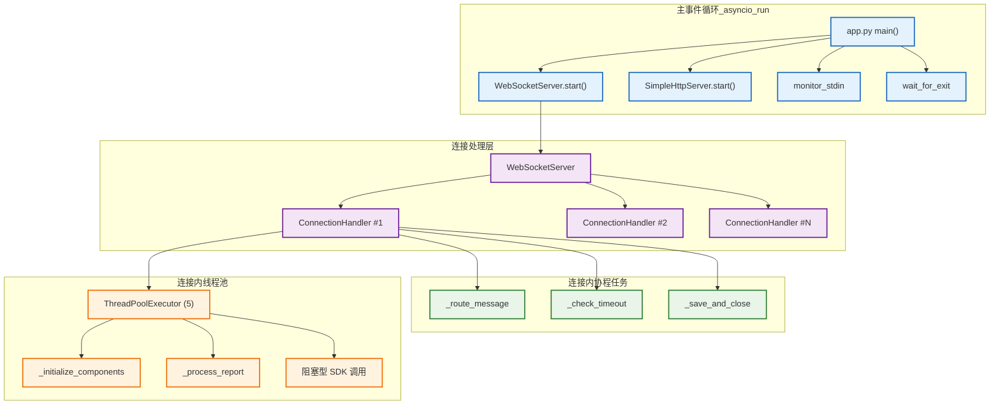

# 并发处理架构模型

> **说明：** 本文档描述当前小智 ESP32 服务器在 asyncio 事件循环与线程池配合下的真实并发模型，帮助开发者理解现状并识别潜在优化空间。

## 并发处理总体结构



## 异步事件循环设计

### 1. 主事件循环职责

- 入口通过 `asyncio.run(main)`（`main/xiaozhi-server/app.py`）创建事件循环，并按需注册退出信号。
- `main()` 内部立即创建三个前台协程：`WebSocketServer.start()`、`SimpleHttpServer.start()` 以及 `monitor_stdin()`，持续运行直至收到退出事件 (`wait_for_exit`)。
- 退出阶段取消所有前台协程并等待它们在 3 秒超时内结束，保证干净关机。

```python
# main/xiaozhi-server/app.py:103
ws_server = WebSocketServer(config)
ws_task = asyncio.create_task(ws_server.start())
ota_server = SimpleHttpServer(config)
ota_task = asyncio.create_task(ota_server.start())
stdin_task = asyncio.create_task(monitor_stdin())
...
await wait_for_exit()
```

### 2. 连接级协程

- `WebSocketServer` 为每个新连接创建 `ConnectionHandler` 实例并调用 `handle_connection()` 协程。
- `ConnectionHandler.handle_connection()` 在单个事件循环内串联处理消息、超时检测与资源释放：
  - `async for message in websocket` 使用同一事件循环驱动消息分发 (`_route_message`)。
  - `asyncio.create_task(self._check_timeout())` 在后台协程中完成连接级的超时关闭。
  - `_save_and_close()` 在连接结束时负责清理并异步落盘记忆。

```python
# main/xiaozhi-server/core/connection.py:118
self.timeout_task = asyncio.create_task(self._check_timeout())
...
async for message in self.websocket:
    await self._route_message(message)
```

- 与事件循环绑定的状态（如 `self.loop = asyncio.get_event_loop()`、`asyncio.Event`）保证协程逻辑保持线程安全，不依赖外部同步原语。

## 线程池使用方式

### 1. 每连接一个小型线程池

- 当前实现为每个 `ConnectionHandler` 创建一个 `ThreadPoolExecutor(max_workers=5)`，与协程共享生命周期。
- 线程池用于承载阻塞型或第三方库调用，防止拖慢事件循环，例如组件初始化、语音合成上报等。

```python
# main/xiaozhi-server/core/connection.py:67
self.executor = ThreadPoolExecutor(max_workers=5)
...
self.executor.submit(self._initialize_components)
self.executor.submit(self._process_report, *item)
```

- 连接关闭时调用 `self.executor.shutdown(wait=False)` 立刻释放线程资源，避免挂起退出流程。

### 2. 队列与跨线程通信

- 连接内部采用 `queue.Queue()`（阻塞队列）在协程与线程之间传递上报数据：

```python
# main/xiaozhi-server/core/connection.py:72
self.report_queue = queue.Queue()
```

- 事件循环线程将待上报项放入 `report_queue`，后台线程通过 `_process_report` 消费并调用同步 SDK。
- 其他轻量状态共享依赖 `threading.Event`（如 `self.stop_event`）确保退出流程一致。

## 并发控制现状

- 当前版本未实现集中式的信号量或速率限制器，系统主要依靠：
  - `asyncio` 自带的协程调度和背压机制；
  - 每连接有限的线程池规模 (`max_workers=5`) 控制阻塞任务上限；
  - 队列大小通过默认无界 `queue.Queue`；如需进一步限制，应在代码层显式设置。
- 文档中先前描述的“多线程池管理器”“异步速率限制器”等仍处于构想阶段，尚未落地。若未来引入，应在此处补充对应实现与配置说明。

## 监控与调优手段

- 目前主要依赖日志 (`config/logger.py`) 与平台级监控观察并发表现。
- 推荐的优化方向：
  1. 引入 `asyncio.Semaphore` / 限流器对 LLM、ASR 请求并发量做细粒度控制。
  2. 将 `report_queue` 改为 `asyncio.Queue` 并在事件循环内统一调度，以减少跨线程上下文切换。
  3. 根据实际负载评估是否需要共享线程池或自适应线程数。

---

📋 **相关文档导航：**
- [01_系统总体架构](01_system_overview.md) - 系统整体架构概览
- [02_连接管理架构](02_connection_management.md) - 连接处理层详细设计
- [04_数据流处理架构](04_data_flow.md) - 数据流向和处理流程
- [06_生命周期管理架构](06_lifecycle_management.md) - 连接生命周期管理

*文档更新时间：2025-03-09*

