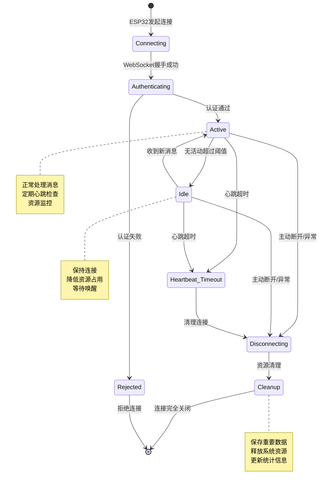
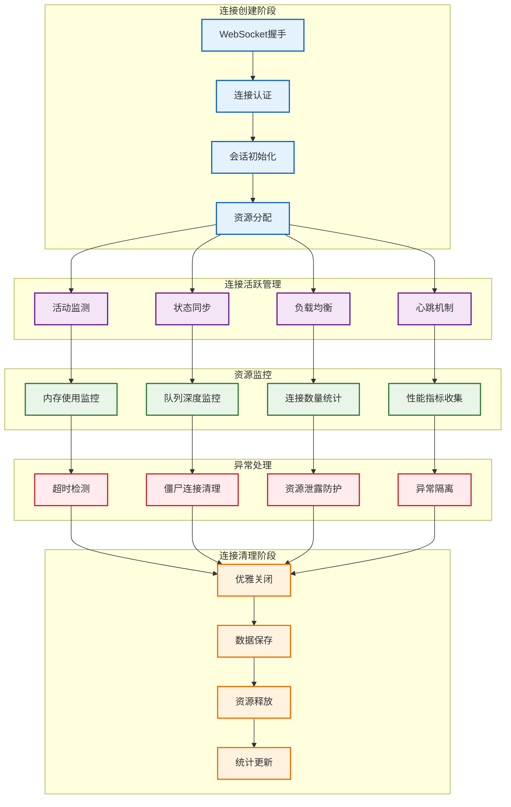
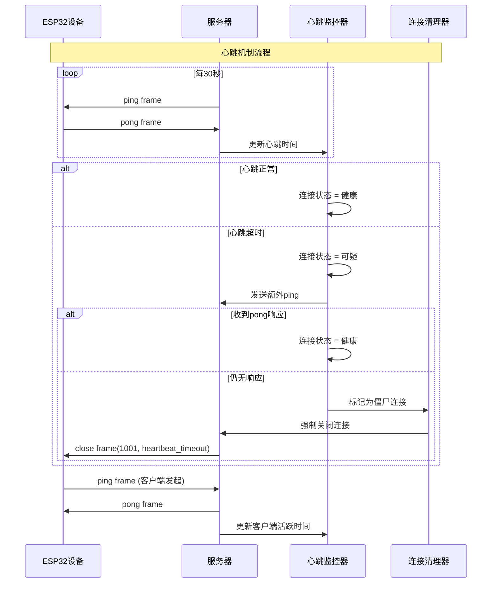
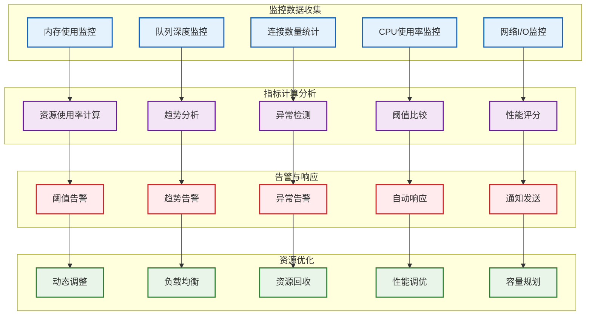
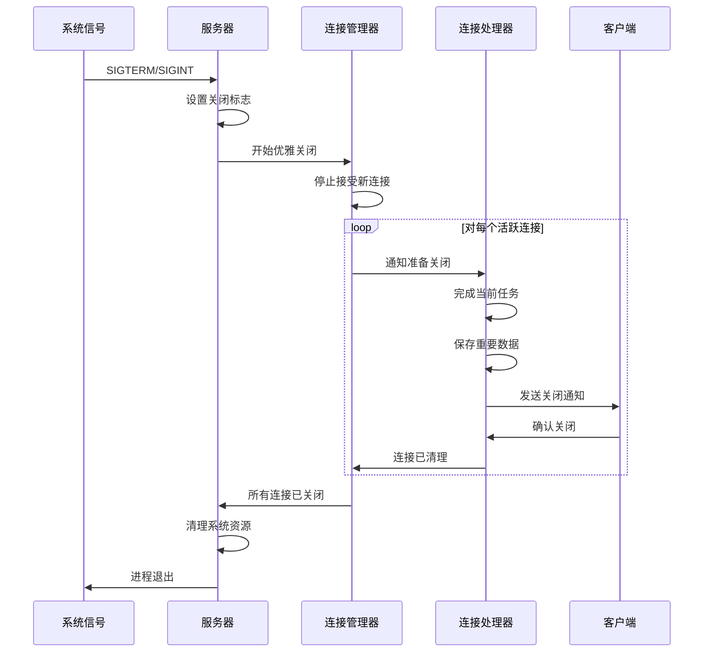

# 连接生命周期管理架构

> **说明：** 详细展示连接生命周期、心跳机制、资源监控和异常处理的完整管理架构。

## 连接生命周期总览



## 连接生命周期管理架构



## 心跳机制设计

### 1. 双向心跳架构



### 2. 心跳管理器实现

```python
import time
import asyncio
from typing import Dict, Set
from enum import Enum

class ConnectionStatus(Enum):
    HEALTHY = "healthy"
    SUSPICIOUS = "suspicious"
    ZOMBIE = "zombie"
    CLOSED = "closed"

class HeartbeatManager:
    def __init__(self):
        self.connections = {}  # session_id -> connection info
        self.heartbeat_interval = 30  # 30秒心跳间隔
        self.heartbeat_timeout = 90   # 90秒心跳超时
        self.suspicious_timeout = 60  # 可疑状态超时
        self.monitoring_task = None
        
    async def register_connection(self, session_id: str, websocket, handler):
        """注册新连接"""
        self.connections[session_id] = {
            'websocket': websocket,
            'handler': handler,
            'status': ConnectionStatus.HEALTHY,
            'last_ping_time': time.time(),
            'last_pong_time': time.time(),
            'last_activity_time': time.time(),
            'ping_failures': 0,
            'total_pings': 0,
            'average_rtt': 0
        }
        
    async def unregister_connection(self, session_id: str):
        """注销连接"""
        if session_id in self.connections:
            del self.connections[session_id]
            
    async def update_activity(self, session_id: str):
        """更新连接活动时间"""
        if session_id in self.connections:
            self.connections[session_id]['last_activity_time'] = time.time()
            if self.connections[session_id]['status'] == ConnectionStatus.SUSPICIOUS:
                self.connections[session_id]['status'] = ConnectionStatus.HEALTHY
                
    async def handle_pong(self, session_id: str):
        """处理pong响应"""
        if session_id in self.connections:
            current_time = time.time()
            conn_info = self.connections[session_id]
            
            # 计算RTT
            rtt = current_time - conn_info['last_ping_time']
            conn_info['last_pong_time'] = current_time
            
            # 更新平均RTT
            total_pings = conn_info['total_pings']
            current_avg_rtt = conn_info['average_rtt']
            conn_info['average_rtt'] = (
                (current_avg_rtt * total_pings + rtt) / (total_pings + 1)
            )
            conn_info['total_pings'] += 1
            
            # 重置状态
            if conn_info['status'] != ConnectionStatus.HEALTHY:
                conn_info['status'] = ConnectionStatus.HEALTHY
                conn_info['ping_failures'] = 0
                
    async def start_monitoring(self):
        """启动心跳监控"""
        self.monitoring_task = asyncio.create_task(self._monitor_heartbeats())
        
    async def _monitor_heartbeats(self):
        """监控心跳状态"""
        while True:
            try:
                current_time = time.time()
                
                for session_id, conn_info in list(self.connections.items()):
                    await self._check_connection_health(session_id, conn_info, current_time)
                
                await asyncio.sleep(10)  # 每10秒检查一次
                
            except asyncio.CancelledError:
                break
            except Exception as e:
                print(f"心跳监控异常: {e}")
                
    async def _check_connection_health(self, session_id: str, conn_info: dict, current_time: float):
        """检查连接健康状态"""
        websocket = conn_info['websocket']
        
        # 检查是否需要发送心跳
        time_since_ping = current_time - conn_info['last_ping_time']
        if time_since_ping >= self.heartbeat_interval:
            try:
                await websocket.ping()
                conn_info['last_ping_time'] = current_time
            except Exception as e:
                print(f"发送心跳失败 {session_id}: {e}")
                await self._mark_connection_for_cleanup(session_id)
                return
                
        # 检查心跳超时
        time_since_pong = current_time - conn_info['last_pong_time']
        
        if time_since_pong > self.heartbeat_timeout:
            # 心跳完全超时，标记为僵尸连接
            conn_info['status'] = ConnectionStatus.ZOMBIE
            await self._mark_connection_for_cleanup(session_id)
            
        elif time_since_pong > self.suspicious_timeout:
            # 进入可疑状态
            if conn_info['status'] == ConnectionStatus.HEALTHY:
                conn_info['status'] = ConnectionStatus.SUSPICIOUS
                conn_info['ping_failures'] += 1
                
                # 发送额外的ping进行确认
                try:
                    await websocket.ping()
                    conn_info['last_ping_time'] = current_time
                except Exception:
                    await self._mark_connection_for_cleanup(session_id)
                    
    async def _mark_connection_for_cleanup(self, session_id: str):
        """标记连接需要清理"""
        if session_id in self.connections:
            self.connections[session_id]['status'] = ConnectionStatus.ZOMBIE
            
            # 通知连接管理器进行清理
            handler = self.connections[session_id]['handler']
            asyncio.create_task(handler.force_close("heartbeat_failure"))
```

## 资源监控系统

### 1. 资源监控架构



### 2. 资源监控器实现

```python
import psutil
import asyncio
import time
from typing import Dict, List, Optional
from collections import deque
from dataclasses import dataclass

@dataclass
class ResourceMetrics:
    timestamp: float
    memory_usage_mb: float
    cpu_usage_percent: float
    active_connections: int
    queue_depth: int
    network_io_bytes: int

class ResourceMonitor:
    def __init__(self, history_size: int = 1000):
        self.metrics_history = deque(maxlen=history_size)
        self.thresholds = {
            'memory_mb': 1024,          # 1GB内存阈值
            'cpu_percent': 80,          # 80% CPU阈值
            'connections': 1000,        # 1000连接数阈值
            'queue_depth': 500,         # 500队列深度阈值
        }
        
        self.alert_callbacks = []
        self.monitoring_task = None
        self.connection_manager = None
        
    def set_connection_manager(self, connection_manager):
        """设置连接管理器引用"""
        self.connection_manager = connection_manager
        
    def add_alert_callback(self, callback):
        """添加告警回调"""
        self.alert_callbacks.append(callback)
        
    async def start_monitoring(self, interval: int = 30):
        """启动资源监控"""
        self.monitoring_task = asyncio.create_task(
            self._monitor_resources(interval)
        )
        
    async def _monitor_resources(self, interval: int):
        """执行资源监控"""
        while True:
            try:
                metrics = await self._collect_metrics()
                self.metrics_history.append(metrics)
                
                # 检查阈值告警
                await self._check_thresholds(metrics)
                
                # 检查趋势告警
                await self._check_trends()
                
                await asyncio.sleep(interval)
                
            except asyncio.CancelledError:
                break
            except Exception as e:
                print(f"资源监控异常: {e}")
                await asyncio.sleep(interval)
                
    async def _collect_metrics(self) -> ResourceMetrics:
        """收集系统资源指标"""
        # 内存使用
        memory_info = psutil.virtual_memory()
        memory_usage_mb = (memory_info.total - memory_info.available) / 1024 / 1024
        
        # CPU使用率
        cpu_usage = psutil.cpu_percent(interval=1)
        
        # 连接数统计
        active_connections = 0
        queue_depth = 0
        
        if self.connection_manager:
            active_connections = len(self.connection_manager.connections)
            queue_depth = 0

            for conn in self.connection_manager.connections.values():
                queue_obj = getattr(conn, 'asr_audio_queue', None)
                if queue_obj is None:
                    continue

                qsize = getattr(queue_obj, 'qsize', None)
                if callable(qsize):
                    try:
                        queue_depth += qsize()
                    except NotImplementedError:
                        continue
        
        # 网络I/O
        network_io = psutil.net_io_counters()
        network_io_bytes = network_io.bytes_sent + network_io.bytes_recv
        
        return ResourceMetrics(
            timestamp=time.time(),
            memory_usage_mb=memory_usage_mb,
            cpu_usage_percent=cpu_usage,
            active_connections=active_connections,
            queue_depth=queue_depth,
            network_io_bytes=network_io_bytes
        )
        
    async def _check_thresholds(self, metrics: ResourceMetrics):
        """检查阈值告警"""
        alerts = []
        
        if metrics.memory_usage_mb > self.thresholds['memory_mb']:
            alerts.append({
                'type': 'threshold',
                'metric': 'memory',
                'value': metrics.memory_usage_mb,
                'threshold': self.thresholds['memory_mb'],
                'severity': 'high' if metrics.memory_usage_mb > self.thresholds['memory_mb'] * 1.5 else 'medium'
            })
            
        if metrics.cpu_usage_percent > self.thresholds['cpu_percent']:
            alerts.append({
                'type': 'threshold',
                'metric': 'cpu',
                'value': metrics.cpu_usage_percent,
                'threshold': self.thresholds['cpu_percent'],
                'severity': 'high' if metrics.cpu_usage_percent > 95 else 'medium'
            })
            
        if metrics.active_connections > self.thresholds['connections']:
            alerts.append({
                'type': 'threshold',
                'metric': 'connections',
                'value': metrics.active_connections,
                'threshold': self.thresholds['connections'],
                'severity': 'medium'
            })
            
        if metrics.queue_depth > self.thresholds['queue_depth']:
            alerts.append({
                'type': 'threshold',
                'metric': 'queue_depth',
                'value': metrics.queue_depth,
                'threshold': self.thresholds['queue_depth'],
                'severity': 'high'  # 队列积压是高优先级问题
            })
        
        # 发送告警
        for alert in alerts:
            await self._send_alert(alert)
            
    async def _check_trends(self):
        """检查趋势告警"""
        if len(self.metrics_history) < 10:
            return
            
        # 获取最近10个数据点
        recent_metrics = list(self.metrics_history)[-10:]
        
        # 检查内存使用趋势
        memory_values = [m.memory_usage_mb for m in recent_metrics]
        memory_trend = self._calculate_trend(memory_values)
        
        if memory_trend > 50:  # 内存增长超过50MB/时间段
            await self._send_alert({
                'type': 'trend',
                'metric': 'memory',
                'trend': memory_trend,
                'severity': 'medium',
                'message': f'内存使用呈上升趋势: +{memory_trend:.2f}MB'
            })
            
        # 检查连接数趋势
        connection_values = [m.active_connections for m in recent_metrics]
        connection_trend = self._calculate_trend(connection_values)
        
        if connection_trend > 10:  # 连接数快速增长
            await self._send_alert({
                'type': 'trend',
                'metric': 'connections',
                'trend': connection_trend,
                'severity': 'low',
                'message': f'连接数增长趋势: +{connection_trend:.0f}个连接'
            })
            
    def _calculate_trend(self, values: List[float]) -> float:
        """计算趋势斜率"""
        if len(values) < 2:
            return 0
            
        # 简单线性回归计算趋势
        n = len(values)
        x_sum = sum(range(n))
        y_sum = sum(values)
        xy_sum = sum(i * values[i] for i in range(n))
        x2_sum = sum(i * i for i in range(n))
        
        # 斜率 = (n*Σxy - Σx*Σy) / (n*Σx² - (Σx)²)
        denominator = n * x2_sum - x_sum * x_sum
        if denominator == 0:
            return 0
            
        slope = (n * xy_sum - x_sum * y_sum) / denominator
        return slope
        
    async def _send_alert(self, alert: dict):
        """发送告警"""
        for callback in self.alert_callbacks:
            try:
                await callback(alert)
            except Exception as e:
                print(f"告警回调异常: {e}")
                
    def get_metrics_summary(self) -> dict:
        """获取指标摘要"""
        if not self.metrics_history:
            return {}
            
        latest = self.metrics_history[-1]
        
        # 计算平均值
        recent_count = min(60, len(self.metrics_history))  # 最近60个数据点
        recent_metrics = list(self.metrics_history)[-recent_count:]
        
        avg_memory = sum(m.memory_usage_mb for m in recent_metrics) / len(recent_metrics)
        avg_cpu = sum(m.cpu_usage_percent for m in recent_metrics) / len(recent_metrics)
        avg_connections = sum(m.active_connections for m in recent_metrics) / len(recent_metrics)
        
        return {
            'latest': {
                'memory_mb': latest.memory_usage_mb,
                'cpu_percent': latest.cpu_usage_percent,
                'connections': latest.active_connections,
                'queue_depth': latest.queue_depth,
                'timestamp': latest.timestamp
            },
            'averages': {
                'memory_mb': avg_memory,
                'cpu_percent': avg_cpu,
                'connections': avg_connections
            },
            'thresholds': self.thresholds
        }
```

## 异常处理与恢复

### 1. 异常处理机制

```python
import asyncio
import inspect
import logging
from typing import Awaitable, Callable, List, Optional

import websockets


class ConnectionExceptionHandler:
    def __init__(
        self,
        *,
        connection_manager=None,
        audit_logger: Optional[logging.Logger] = None,
    ):
        self.connection_manager = connection_manager
        self.audit_logger = audit_logger or logging.getLogger(__name__)
        self.cleanup_callbacks: List[Callable[[str], Awaitable[None]]] = []

        self.exception_stats = {
            'connection_errors': 0,
            'timeout_errors': 0,
            'protocol_errors': 0,
            'resource_errors': 0,
            'unknown_errors': 0
        }

        self.recovery_strategies = {
            ConnectionResetError: self._handle_connection_reset,
            asyncio.TimeoutError: self._handle_timeout,
            websockets.exceptions.ConnectionClosed: self._handle_connection_closed,
            MemoryError: self._handle_memory_error,
            OSError: self._handle_os_error
        }

    def register_cleanup_callback(self, callback: Callable[[str], Awaitable[None]]) -> None:
        self.cleanup_callbacks.append(callback)

    async def handle_exception(self, session_id: str, exception: Exception, context: dict) -> None:
        """处理连接异常并执行对应的恢复策略"""
        handler = self._resolve_handler(exception)
        self._update_exception_stats(exception)
        await self._log_exception(session_id, exception, context)
        await handler(session_id, exception, context)

    def _resolve_handler(self, exception: Exception):
        for exc_type, handler in self.recovery_strategies.items():
            if isinstance(exception, exc_type):
                return handler
        return self._handle_unknown_error

    def _update_exception_stats(self, exception: Exception) -> None:
        """更新异常统计"""
        exception_type = type(exception).__name__
        if 'Connection' in exception_type or 'connection' in exception_type.lower():
            self.exception_stats['connection_errors'] += 1
        elif 'Timeout' in exception_type or 'timeout' in exception_type.lower():
            self.exception_stats['timeout_errors'] += 1
        elif 'Protocol' in exception_type or 'protocol' in exception_type.lower():
            self.exception_stats['protocol_errors'] += 1
        elif 'Memory' in exception_type or 'Resource' in exception_type:
            self.exception_stats['resource_errors'] += 1
        else:
            self.exception_stats['unknown_errors'] += 1

    async def _handle_connection_reset(self, session_id: str, exception: Exception, context: dict) -> None:
        self.audit_logger.warning("连接重置 %s: %s", session_id, exception)
        await self._force_close_connection(session_id, "connection_reset")

    async def _handle_timeout(self, session_id: str, exception: Exception, context: dict) -> None:
        self.audit_logger.warning("连接超时 %s: %s", session_id, exception)
        await self._force_close_connection(session_id, "timeout")

    async def _handle_connection_closed(self, session_id: str, exception: Exception, context: dict) -> None:
        self.audit_logger.info("连接已关闭 %s: %s", session_id, exception)
        await self._cleanup_connection(session_id)

    async def _handle_memory_error(self, session_id: str, exception: Exception, context: dict) -> None:
        self.audit_logger.error("内存错误 %s: %s", session_id, exception)
        await self._emergency_resource_cleanup(session_id)
        await self._force_close_connection(session_id, "memory_error")

    async def _handle_os_error(self, session_id: str, exception: Exception, context: dict) -> None:
        self.audit_logger.error("系统错误 %s: %s", session_id, exception)
        await self._force_close_connection(session_id, "os_error")

    async def _handle_unknown_error(self, session_id: str, exception: Exception, context: dict) -> None:
        self.audit_logger.error("未知异常 %s: %s", session_id, exception)
        await self._force_close_connection(session_id, "unknown_error")

    async def _log_exception(self, session_id: str, exception: Exception, context: dict) -> None:
        log_context = {'session_id': session_id, **context}
        self.audit_logger.exception("连接异常 %s", session_id, extra={'context': log_context})

    async def _force_close_connection(self, session_id: str, reason: str) -> None:
        if not self.connection_manager:
            return

        handler = None
        if hasattr(self.connection_manager, 'connections'):
            handler = self.connection_manager.connections.get(session_id)
        if handler is None and hasattr(self.connection_manager, 'get_connection'):
            handler = self.connection_manager.get_connection(session_id)

        if handler is None:
            return

        close_callable = getattr(handler, 'force_close', None)
        if callable(close_callable):
            result = close_callable(reason)
            if inspect.isawaitable(result):
                await result
        else:
            websocket = getattr(handler, 'websocket', None)
            if websocket is not None:
                close_result = websocket.close(code=1011, reason=reason)
                if inspect.isawaitable(close_result):
                    await close_result

        await self._cleanup_connection(session_id, handler)

    async def _cleanup_connection(self, session_id: str, handler=None) -> None:
        managed_handler = None
        if self.connection_manager and hasattr(self.connection_manager, 'connections'):
            managed_handler = self.connection_manager.connections.pop(session_id, None)
        handler = handler or managed_handler

        unregister = getattr(self.connection_manager, 'unregister_connection', None)
        if callable(unregister):
            result = unregister(session_id)
            if inspect.isawaitable(result):
                await result

        if handler and hasattr(handler, 'release_resources'):
            cleanup_result = handler.release_resources()
            if inspect.isawaitable(cleanup_result):
                await cleanup_result

        for callback in self.cleanup_callbacks:
            result = callback(session_id)
            if inspect.isawaitable(result):
                await result

    async def _emergency_resource_cleanup(self, session_id: str) -> None:
        if not self.connection_manager or not hasattr(self.connection_manager, 'connections'):
            return

        handler = self.connection_manager.connections.get(session_id)
        if handler is None:
            return

        audio_queue = getattr(handler, 'asr_audio_queue', None)
        if audio_queue is not None and hasattr(audio_queue, 'empty'):
            while not audio_queue.empty():
                try:
                    audio_queue.get_nowait()
                except Exception:
                    break

        audio_buffer = getattr(handler, 'client_audio_buffer', None)
        if isinstance(audio_buffer, (bytearray, list)):
            audio_buffer.clear()
```

## 优雅关闭机制

### 1. 优雅关闭流程



### 2. 优雅关闭实现

```python
class GracefulShutdownManager:
    def __init__(self):
        self.shutdown_initiated = False
        self.shutdown_timeout = 30  # 30秒强制关闭超时
        self.connection_manager = None
        self.background_tasks = set()
        
    def set_connection_manager(self, connection_manager):
        self.connection_manager = connection_manager
        
    async def initiate_shutdown(self):
        """启动优雅关闭流程"""
        if self.shutdown_initiated:
            return
            
        self.shutdown_initiated = True
        print("开始优雅关闭流程...")
        
        try:
            # 设置超时保护
            await asyncio.wait_for(
                self._shutdown_sequence(),
                timeout=self.shutdown_timeout
            )
        except asyncio.TimeoutError:
            print("优雅关闭超时，执行强制关闭")
            await self._force_shutdown()
            
    async def _shutdown_sequence(self):
        """执行关闭序列"""
        # 1. 停止接受新连接
        if self.connection_manager:
            await self.connection_manager.stop_accepting_connections()
            
        # 2. 通知所有连接准备关闭
        await self._notify_connections_shutdown()
        
        # 3. 等待连接完成当前任务
        await self._wait_for_connection_cleanup()
        
        # 4. 取消后台任务
        await self._cancel_background_tasks()
        
        # 5. 清理系统资源
        await self._cleanup_system_resources()
        
        print("优雅关闭完成")
        
    async def _notify_connections_shutdown(self):
        """通知所有连接准备关闭"""
        if not self.connection_manager:
            return
            
        shutdown_tasks = []
        for session_id, handler in self.connection_manager.connections.items():
            task = asyncio.create_task(
                self._notify_single_connection(session_id, handler)
            )
            shutdown_tasks.append(task)
            
        if shutdown_tasks:
            await asyncio.gather(*shutdown_tasks, return_exceptions=True)
            
    async def _notify_single_connection(self, session_id: str, handler):
        """通知单个连接关闭"""
        try:
            # 发送关闭通知
            await handler.send_shutdown_notification()
            
            # 设置关闭标志
            handler.set_shutdown_flag()
            
        except Exception as e:
            print(f"通知连接关闭失败 {session_id}: {e}")
            
    async def _wait_for_connection_cleanup(self):
        """等待连接清理完成"""
        max_wait_time = 20  # 最多等待20秒
        wait_interval = 0.5
        waited_time = 0
        
        while waited_time < max_wait_time:
            if not self.connection_manager or len(self.connection_manager.connections) == 0:
                break
                
            await asyncio.sleep(wait_interval)
            waited_time += wait_interval
            
            # 显示进度
            remaining_connections = len(self.connection_manager.connections)
            print(f"等待 {remaining_connections} 个连接关闭...")
            
        # 强制关闭剩余连接
        if self.connection_manager and len(self.connection_manager.connections) > 0:
            print(f"强制关闭剩余 {len(self.connection_manager.connections)} 个连接")
            await self._force_close_remaining_connections()
            
    async def _force_close_remaining_connections(self):
        """强制关闭剩余连接"""
        force_close_tasks = []
        
        for session_id, handler in list(self.connection_manager.connections.items()):
            task = asyncio.create_task(
                handler.force_close("server_shutdown")
            )
            force_close_tasks.append(task)
            
        if force_close_tasks:
            await asyncio.gather(*force_close_tasks, return_exceptions=True)
            
    async def _cancel_background_tasks(self):
        """取消后台任务"""
        for task in self.background_tasks:
            if not task.done():
                task.cancel()
                
        # 等待任务完成
        if self.background_tasks:
            await asyncio.gather(*self.background_tasks, return_exceptions=True)
            
    async def _cleanup_system_resources(self):
        """清理系统资源"""
        # 关闭HTTP连接池
        # 关闭数据库连接
        # 清理临时文件
        # 保存统计数据
        pass
        
    async def _force_shutdown(self):
        """强制关闭"""
        print("执行强制关闭...")
        
        # 取消所有任务
        tasks = [task for task in asyncio.all_tasks() if task != asyncio.current_task()]
        for task in tasks:
            task.cancel()
            
        # 等待任务取消
        await asyncio.gather(*tasks, return_exceptions=True)
```

---

📋 **相关文档导航：**
- [01_系统总体架构](01_system_overview.md) - 系统整体架构概览
- [02_连接管理架构](02_connection_management.md) - 连接处理层详细设计
- [05_并发处理架构](05_concurrency_model.md) - 并发处理模型
- [architecture_diagram_original.md](architecture_diagram_original.md) - 原始完整架构图

*图表创建时间：2025-08-24*
