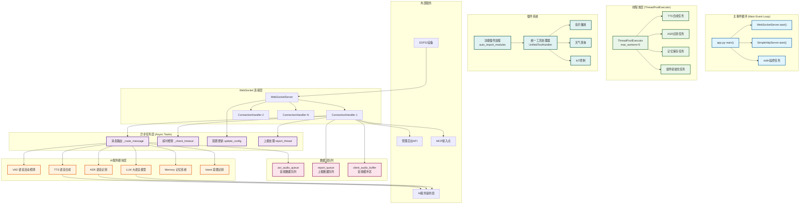
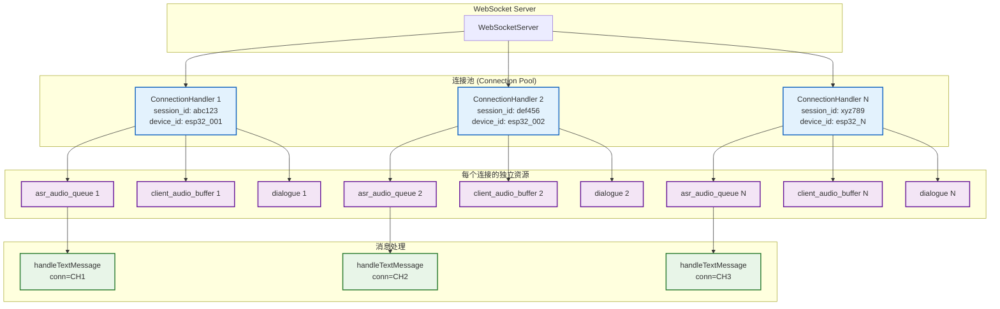
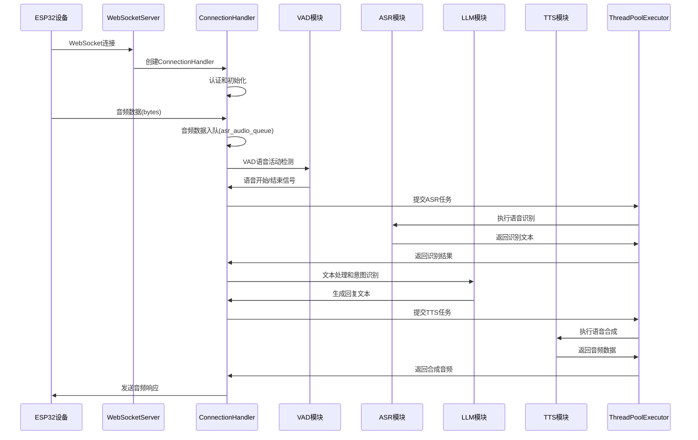
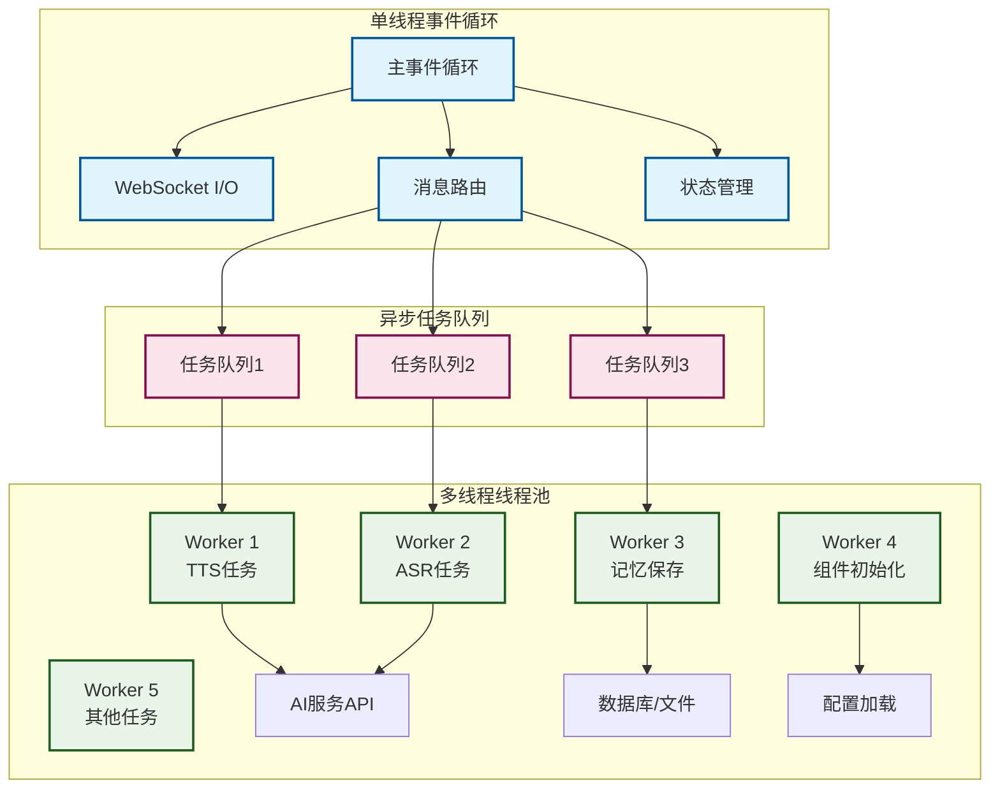

# 小智 ESP32 服务器系统架构框图 (原始完整版)

> **说明：** 这是原始的完整架构图备份文件，包含所有详细信息。现已拆分为多个小框图以便分析。

## 整体架构图



## 详细架构说明

### 1. 主事件循环层 (Main Event Loop)

**职责**：
- 统一管理所有异步任务
- 提供事件调度和协程调度
- 处理系统信号和优雅关闭

**关键组件**：
- `app.py main()` - 应用入口点
- `WebSocketServer.start()` - WebSocket服务启动
- `SimpleHttpServer.start()` - HTTP服务启动
- `stdin监控任务` - 标准输入处理

### 2. WebSocket 连接层

**职责**：
- 管理客户端连接生命周期
- 为每个连接创建独立的处理实例
- 处理连接认证和配置

**关键特性**：
- 每个连接独立的 `ConnectionHandler`
- 连接级别的状态管理
- 自动超时检测和清理

### 3. 异步任务层 (Async Tasks)

**职责**：
- 处理I/O密集型操作
- 管理异步消息路由
- 执行定时任务和监控

**核心任务**：
- `_route_message()` - 消息路由和分发
- `_check_timeout()` - 连接超时检查
- `update_config()` - 配置热更新
- `report_thread` - 统计数据上报

### 异步任务层的高并发消息路由机制

**当连接设备多达几百几千时，消息路由通过以下机制区分不同连接：**

#### 1. 连接级别的状态隔离
每个 `ConnectionHandler` 实例都维护自己独立的状态空间：

```python
class ConnectionHandler:
    def __init__(self):
        # 连接唯一标识
        self.session_id = str(uuid.uuid4())  # 唯一会话ID
        self.device_id = None               # 设备ID  
        self.client_ip = None               # 客户端IP
        
        # 连接级别的队列和缓冲区
        self.asr_audio_queue = queue.Queue()      # 每个连接独立的音频队列
        self.client_audio_buffer = bytearray()    # 每个连接独立的音频缓冲区
        self.dialogue = Dialogue()               # 每个连接独立的对话历史
```

#### 2. 消息路由机制
消息路由通过 **连接实例传递** 实现区分：

```python
# WebSocketServer 层
async def _handle_connection(self, websocket):
    handler = ConnectionHandler(config, ...)  # 为每个连接创建独立实例
    await handler.handle_connection(websocket)     # 传递连接实例

# ConnectionHandler 层  
async def _route_message(self, message):
    if isinstance(message, str):
        await handleTextMessage(self, message)   # 传入 self（当前连接实例）
    elif isinstance(message, bytes):
        self.asr_audio_queue.put(message)      # 存入当前连接的队列
```

#### 3. 处理函数的连接上下文
所有处理函数都接收 `conn` 参数，确保操作正确的连接：

```python
async def handleTextMessage(conn, message):
    # conn 包含了完整的连接状态
    device_id = conn.device_id
    session_id = conn.session_id
    websocket = conn.websocket
    
    # 操作当前连接的对话历史
    conn.dialogue.add_message(role, content)

async def handleAudioMessage(conn, audio):
    # 操作当前连接的音频数据
    have_voice = conn.vad.is_vad(conn, audio)
    conn.asr_audio.append(audio)
```

#### 4. 音频处理的线程隔离
每个连接有独立的ASR处理线程：

```python
def asr_text_priority_thread(self, conn):
    while not conn.stop_event.is_set():
        message = conn.asr_audio_queue.get(timeout=1)  # 从当前连接队列获取
        future = asyncio.run_coroutine_threadsafe(
            handleAudioMessage(conn, message),  # 传入当前连接实例
            conn.loop,
        )
```

#### 5. 高并发架构设计
当设备多达几百几千时，系统通过以下架构支持高并发：



#### 6. 关键设计优势

**状态隔离**：
- 每个连接完全独立，无状态共享
- 连接崩溃不影响其他连接
- 支持不同设备的不同配置

**资源独立**：
- 每个连接独立的队列、缓冲区、对话历史
- 避免资源竞争和锁机制
- 内存使用随连接数线性增长

**消息路由**：
- 通过连接实例传递确保消息归属
- 处理函数始终操作正确的连接状态
- 支持连接级别的个性化配置

**扩展性**：
- 连接数增加不会影响现有连接性能
- 可以轻松支持数千个并发连接
- 每个连接可以有不同的AI服务配置

#### 7. 实际运行示例

```python
# 设备1连接
conn1 = ConnectionHandler()
conn1.device_id = "esp32_001"
conn1.session_id = "abc123"

# 设备2连接  
conn2 = ConnectionHandler()
conn2.device_id = "esp32_002"
conn2.session_id = "def456"

# 消息处理时
await handleTextMessage(conn1, message1)  # 操作设备1的状态
await handleTextMessage(conn2, message2)  # 操作设备2的状态，完全独立
```

### 连接生命周期管理

#### 1. 连接泤露检测机制
为防止连接泄露导致系统资源耗尽，系统实现了多层防护机制：

```python
class ConnectionLifecycleManager:
    def __init__(self):
        self.connection_registry = {}  # 连接注册表
        self.zombie_detector = ZombieConnectionDetector()
        self.resource_monitor = ResourceMonitor()
    
    async def register_connection(self, conn):
        self.connection_registry[conn.session_id] = {
            'handler': conn,
            'created_time': time.time(),
            'last_activity': time.time(),
            'message_count': 0,
            'resource_usage': self.get_connection_resources(conn)
        }
    
    async def cleanup_zombie_connections(self):
        """24/7 后台任务，检测并清理僵尸连接"""
        current_time = time.time()
        for session_id, info in list(self.connection_registry.items()):
            # 检查超时连接
            if current_time - info['last_activity'] > ZOMBIE_TIMEOUT:
                logger.warning(f"检测到僵尸连接: {session_id}")
                await self.force_cleanup_connection(session_id)
            
            # 检查资源占用过高的连接
            if self.is_resource_excessive(info):
                logger.warning(f"连接 {session_id} 资源占用过高，强制清理")
                await self.force_cleanup_connection(session_id)
```

#### 2. 心跳机制
为确保连接的活性，系统实现了双向心跳机制：

```python
class HeartbeatManager:
    def __init__(self, conn):
        self.conn = conn
        self.last_ping = time.time()
        self.last_pong = time.time()
        self.heartbeat_interval = 30  # 30秒心跳
        self.heartbeat_timeout = 90   # 90秒超时
    
    async def start_heartbeat(self):
        """ESP32 端发起心跳检查"""
        while not self.conn.stop_event.is_set():
            try:
                await self.conn.websocket.ping()
                self.last_ping = time.time()
                
                # 等待 pong 响应
                await asyncio.sleep(self.heartbeat_interval)
                
                if time.time() - self.last_pong > self.heartbeat_timeout:
                    logger.warning(f"连接 {self.conn.session_id} 心跳超时")
                    await self.conn.close_connection("heartbeat_timeout")
                    break
                    
            except websockets.exceptions.ConnectionClosed:
                break
            except Exception as e:
                logger.error(f"心跳检查异常: {e}")
                break
```

#### 3. 资源监控与清理
实时监控每个连接的资源使用情况：

```python
class ResourceMonitor:
    def __init__(self):
        self.memory_threshold = 50 * 1024 * 1024  # 50MB per connection
        self.queue_threshold = 1000  # 音频队列最大数量
        self.cpu_threshold = 80      # CPU 使用率阈值
    
    def get_connection_memory_usage(self, conn):
        """计算连接的内存占用"""
        memory_usage = 0
        memory_usage += len(conn.client_audio_buffer)
        memory_usage += conn.asr_audio_queue.qsize() * 1024  # 估算1KB/消息
        memory_usage += len(str(conn.dialogue)) * 2  # 对话历史大小
        return memory_usage
    
    def check_resource_limits(self, conn):
        """检查资源限制"""
        violations = []
        
        # 内存检查
        memory_usage = self.get_connection_memory_usage(conn)
        if memory_usage > self.memory_threshold:
            violations.append(f"memory_exceeded: {memory_usage}")
        
        # 队列检查
        if conn.asr_audio_queue.qsize() > self.queue_threshold:
            violations.append(f"queue_overflow: {conn.asr_audio_queue.qsize()}")
        
        return violations
    
    async def force_resource_cleanup(self, conn):
        """强制资源清理"""
        # 清理音频缓冲
        conn.client_audio_buffer.clear()
        
        # 清理队列
        while not conn.asr_audio_queue.empty():
            try:
                conn.asr_audio_queue.get_nowait()
            except:
                break
        
        # 清理对话历史(保留最近10条)
        if len(conn.dialogue.dialogue) > 10:
            conn.dialogue.dialogue = conn.dialogue.dialogue[-10:]
        
        logger.info(f"已对连接 {conn.session_id} 执行强制资源清理")
```

#### 4. 优雅关闭机制
确保连接在关闭时正确清理所有资源：

```python
async def graceful_connection_shutdown(conn, reason="normal_close"):
    """优雅关闭连接"""
    try:
        # 1. 停止新任务接收
        conn.stop_event.set()
        
        # 2. 等待当前任务完成
        if hasattr(conn, 'current_tasks'):
            await asyncio.gather(*conn.current_tasks, return_exceptions=True)
        
        # 3. 保存重要数据
        if conn.memory and len(conn.dialogue.dialogue) > 0:
            await conn.memory.save_memory(conn.dialogue.dialogue)
        
        # 4. 清理资源
        await cleanup_connection_resources(conn)
        
        # 5. 关闭 WebSocket
        if not conn.websocket.closed:
            await conn.websocket.close(code=1000, reason=reason)
            
        # 6. 从注册表中移除
        connection_manager.unregister_connection(conn.session_id)
        
        logger.info(f"连接 {conn.session_id} 已优雅关闭: {reason}")
        
    except Exception as e:
        logger.error(f"优雅关闭连接时出错: {e}")
        # 强制关闭
        await force_close_connection(conn)
```

### 4. 线程池层 (ThreadPoolExecutor)

**职责**：
- 处理CPU密集型任务
- 避免阻塞主事件循环
- 提供任务并发执行

**任务类型**：
- `TTS合成任务` - 文本转语音
- `ASR识别任务` - 语音转文本
- `记忆保存任务` - 异步保存对话历史
- `组件初始化任务` - 后台组件初始化

### 5. AI服务模块层

**职责**：
- 提供核心AI能力
- 支持多种服务提供商
- 统一的接口规范

**核心模块**：
- `VAD` - 语音活动检测
- `ASR` - 语音识别
- `LLM` - 大语言模型
- `TTS` - 语音合成
- `Memory` - 记忆系统
- `Intent` - 意图识别

### 5.1 AI服务模块层集成方式

**不是通过传统的SDK形式，而是通过多种集成方式实现：**

#### 1. HTTP API集成（主要方式）
大多数AI服务提供商通过HTTP REST API调用：
- **LLM服务**：OpenAI、阿里云、豆包、Gemini等通过 `requests`/`httpx`/`aiohttp` 调用API
- **TTS服务**：腾讯云、阿里云、豆包等通过HTTP请求获取语音合成
- **ASR服务**：百度、阿里云、腾讯等通过HTTP API上传音频获取识别结果

#### 2. Python客户端库集成
部分服务使用官方Python SDK：
- **OpenAI**：使用 `openai` Python客户端库
- **MCP协议**：使用 `mcp.client.stdio`、`mcp.client.sse` 客户端

#### 3. 本地模型集成
本地部署的AI服务：
- **VAD服务**：Silero VAD通过 `torch.hub.load()` 加载本地模型
- **ASR服务**：FunASR、Sherpa-ONNX等本地模型
- **TTS服务**：FishSpeech、GPT-SoVITS等本地部署

#### 4. 统一接口设计
所有AI服务都遵循统一的基类接口：

```python
# LLM服务基类
class LLMProviderBase(ABC):
    @abstractmethod
    def response(self, session_id, dialogue): pass

# TTS服务基类  
class TTSProviderBase(ABC):
    @abstractmethod
    def text_to_speech(self, text): pass

# ASR服务基类
class ASRProviderBase(ABC):
    @abstractmethod
    def speech_to_text(self, audio_data): pass
```

#### 5. 调用流程
```
WebSocketServer → ConnectionHandler → AI Provider → 第三方服务
     ↓                    ↓              ↓           ↓
  接收消息         消息路由处理      调用AI服务    HTTP/本地调用
     ↓                    ↓              ↓           ↓
  返回响应         处理响应结果      返回AI结果    API响应
```

#### 6. 配置驱动
通过配置文件决定使用哪个AI服务提供商：

```yaml
selected_module:
  LLM: openai
  TTS: aliyun  
  ASR: doubao
  VAD: silero

LLM:
  openai:
    model_name: gpt-4
    api_key: your-api-key
    base_url: https://api.openai.com/v1

TTS:
  aliyun:
    app_key: your-app-key
    access_key_id: your-access-key
    voice: xiaoyun
```

#### 7. 架构优势
- **插件化**：新增AI服务只需实现基类接口
- **可替换**：通过配置文件轻松切换服务提供商
- **统一管理**：所有AI服务通过工厂模式统一创建
- **异步处理**：支持流式响应和异步调用
- **容错性**：单个AI服务故障不影响整体系统

#### 8. 异步处理优化（实现要点）
- 复用 `aiohttp.ClientSession`，减少连接开销；为不同服务设置独立连接池大小。
- 使用超时与重试策略：`timeout=5s`，指数退避重试 `1s -> 2s -> 4s`。
- LLM 流式响应：优先使用 SSE / WebSocket 流式接口，边到边处理。
- 并发窗口控制：限制同一连接的下游并发请求数（如 LLM 同时只允许1个）。
- 熔断机制：AI 服务错误率持续上升时，开启熔断并降级回复。

```python
# aiohttp 客户端复用示例
class HttpClientPool:
    def __init__(self):
        timeout = aiohttp.ClientTimeout(total=10)
        connector = aiohttp.TCPConnector(limit=100, ssl=False)
        self.session = aiohttp.ClientSession(timeout=timeout, connector=connector)

    async def get_json(self, url, **kwargs):
        for delay in (0.5, 1, 2):
            try:
                async with self.session.get(url, **kwargs) as resp:
                    resp.raise_for_status()
                    return await resp.json()
            except Exception:
                await asyncio.sleep(delay)
        raise
```

### 6. 数据流队列

**职责**：
- 缓冲和调度数据流
- 提供异步数据传递
- 实现生产者-消费者模式

**关键队列**：
- `asr_audio_queue` - 音频数据队列
- `report_queue` - 上报数据队列
- `client_audio_buffer` - 音频缓冲区

### 7. 插件系统

**职责**：
- 提供功能扩展能力
- 统一的工具调用接口
- 动态加载和管理

**功能插件**：
- 音乐播放、天气查询、IoT控制
- 统一的 `UnifiedToolHandler`
- 自动模块导入机制

## 数据流向图



## 并发处理模型



## 性能特性

### 1. 事件驱动优势
- **高并发**：单线程处理数千连接
- **低延迟**：非阻塞I/O操作
- **资源高效**：避免线程切换开销

### 2. 异步处理特点
- **响应式**：快速响应客户端请求
- **流式处理**：支持音频流实时处理
- **背压控制**：防止消息积压

### 3. 线程池优化
- **CPU密集型任务**：避免阻塞主循环
- **并发限制**：控制最大并发数
- **资源复用**：线程复用减少创建开销

### 4. 容错机制
- **异常隔离**：单连接错误不影响其他连接
- **优雅降级**：服务不可用时的降级处理
- **自动恢复**：连接断开后的自动重连

## 运维监控与扩展性设计

### 1. 关键性能指标 (KPIs)
- 连接数实时监控：active_connections 数量、增长率
- ASR/TTS 处理延迟：P50/P95/P99
- 音频队列深度：asr_audio_queue.qsize()
- AI 服务错误率与超时率：按 Provider 分类
- 内存/CPU 使用率：系统与每连接维度

### 2. 告警与自愈
- 阈值告警：连接数、延迟、错误率、队列积压
- 自愈策略：熔断、降级、自动重启异常处理线程
- 限流策略：临时拒绝新连接 (503 / 1013)

### 3. 日志与追踪
- 结构化日志：JSON 格式，字段包含 session_id/device_id
- 链路追踪：关联一次交互的 VAD/ASR/LLM/TTS 全链路日志
- 隐私保护：日志脱敏，不记录敏感音频/文本内容

### 4. 容量规划建议
- 单实例建议 200-500 活跃连接（取决于启用模块）
- 横向扩展：多实例+负载均衡，长连接粘性路由
- 服务拆分：ASR/LLM/TTS 独立服务化

### 5. 配置与系统调优
- asyncio 事件循环策略：Proactor (Windows) / uvloop (Linux)
- 线程池大小：5-10（视CPU核数与任务类型调整）
- OS 资源：句柄/端口/内核参数调优

---

*架构图创建时间: 2025-08-21*
*备份时间: 2025-08-24*
