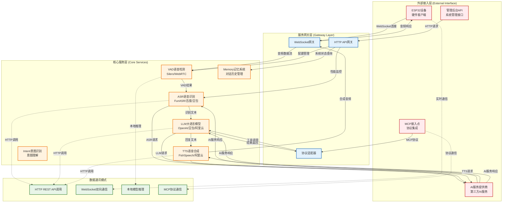
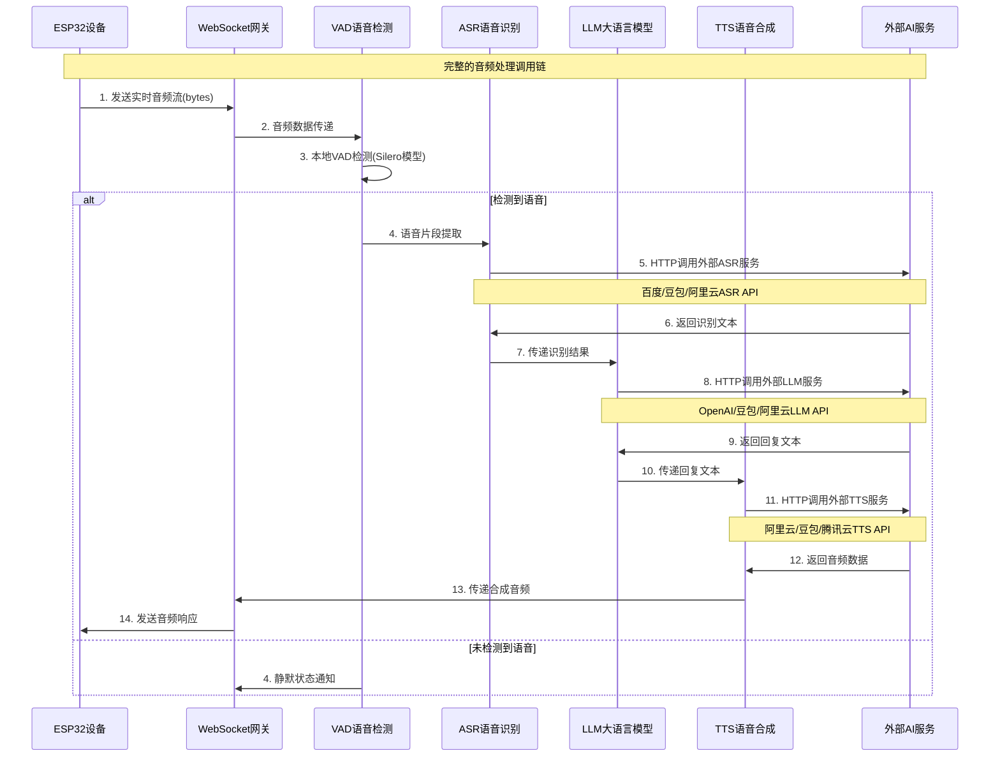
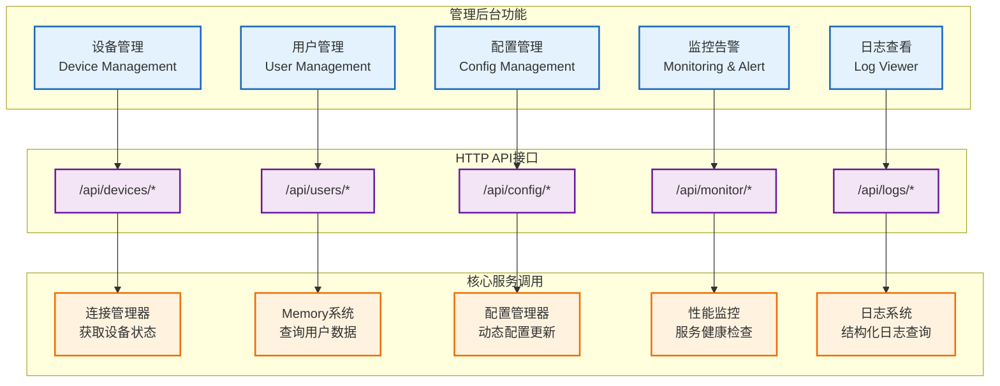
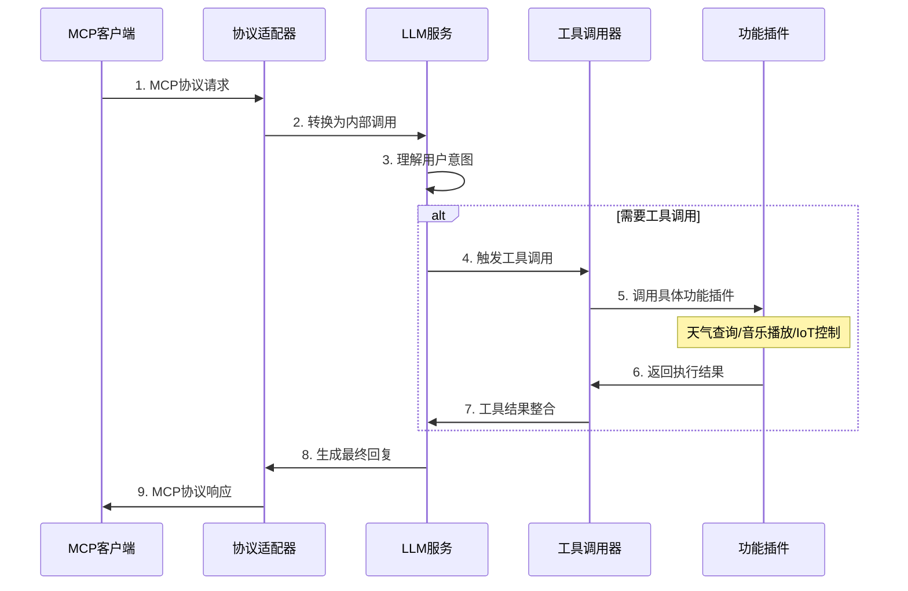
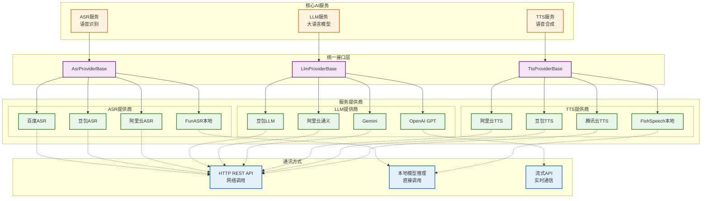

# 核心服务层与外部接入层调用关系分析

> **说明：** 详细分析核心服务层与外部接入层之间的调用关系、数据通讯模式和功能实现。

## 整体调用关系架构



## 详细调用关系分析

### 1. ESP32设备 ↔ 核心服务层

#### 1.1 音频处理链路



#### 1.2 功能实现详情

**ESP32设备端功能：**
- 🎤 **音频采集**：实时麦克风数据采集（PCM格式）
- 📡 **数据传输**：WebSocket双向通信
- 🔊 **音频播放**：接收并播放TTS合成的音频
- 🔋 **电源管理**：低功耗模式和唤醒机制

**核心服务层功能：**
- 🎯 **VAD检测**：实时语音活动检测，过滤静默片段
- 🗣️ **ASR识别**：将语音转换为文本，支持多语言
- 🧠 **LLM处理**：理解用户意图，生成智能回复
- 🔊 **TTS合成**：将文本转换为自然语音
- 💾 **记忆管理**：维护对话上下文和历史记录

### 2. 管理后台API ↔ 核心服务层

#### 2.1 管理接口调用



#### 2.2 具体API调用示例

```python
# 管理后台API调用核心服务层的典型实现

class ManagementApiHandler:
    def __init__(self, core_services):
        self.core_services = core_services
    
    async def get_device_status(self, device_id: str):
        """获取设备状态 - 调用连接管理器"""
        connection_manager = self.core_services.get('connection_manager')
        return await connection_manager.get_device_status(device_id)
    
    async def update_ai_config(self, config_data: dict):
        """更新AI配置 - 调用配置管理器"""
        config_manager = self.core_services.get('config_manager')
        # 动态更新ASR/LLM/TTS配置
        await config_manager.update_ai_providers(config_data)
        
        # 重新初始化AI服务实例
        ai_scheduler = self.core_services.get('ai_scheduler')
        await ai_scheduler.reload_services()
    
    async def get_conversation_history(self, user_id: str):
        """获取对话历史 - 调用Memory系统"""
        memory_service = self.core_services.get('memory')
        return await memory_service.get_user_conversations(user_id)
    
    async def get_system_metrics(self):
        """获取系统指标 - 调用监控服务"""
        metrics = {}
        
        # ASR服务状态
        asr_service = self.core_services.get('asr')
        metrics['asr'] = await asr_service.get_health_status()
        
        # LLM服务状态  
        llm_service = self.core_services.get('llm')
        metrics['llm'] = await llm_service.get_health_status()
        
        # TTS服务状态
        tts_service = self.core_services.get('tts')
        metrics['tts'] = await tts_service.get_health_status()
        
        return metrics
```

### 3. MCP接入点 ↔ 核心服务层

#### 3.1 MCP协议集成



#### 3.2 MCP功能实现

**MCP接入点功能：**
- 🔌 **协议转换**：MCP协议与内部API的双向转换
- 🛠️ **工具集成**：统一的工具调用接口
- 📋 **资源管理**：MCP资源的动态注册和发现
- 🔒 **权限控制**：MCP客户端的访问权限管理

### 4. AI服务提供商 ↔ 核心服务层

#### 4.1 多提供商集成架构



#### 4.2 AI服务调用实现

```python
class AiServiceManager:
    def __init__(self, config):
        self.config = config
        self.service_factory = ServiceFactory(config)
        self.http_client_pool = HttpClientPool()
        
    async def call_asr_service(self, audio_data: bytes) -> str:
        """调用ASR服务"""
        provider = self.config['selected_modules']['ASR']
        asr_service = await self.service_factory.create_asr_service()
        
        if provider in ['baidu', 'doubao', 'aliyun']:
            # HTTP API调用
            async with self.http_client_pool.get_session(provider) as session:
                return await asr_service.speech_to_text(audio_data)
        else:
            # 本地模型调用
            return await asr_service.speech_to_text(audio_data)
    
    async def call_llm_service(self, messages: list) -> str:
        """调用LLM服务"""
        provider = self.config['selected_modules']['LLM']
        llm_service = await self.service_factory.create_llm_service()
        
        # 支持流式和非流式调用
        if self.config.get('stream_mode', False):
            response_chunks = []
            async for chunk in llm_service.stream_chat_completion(messages):
                response_chunks.append(chunk)
                # 实时流式返回给客户端
                yield chunk
            return ''.join(response_chunks)
        else:
            return await llm_service.chat_completion(messages)
    
    async def call_tts_service(self, text: str, voice: str = None) -> bytes:
        """调用TTS服务"""
        provider = self.config['selected_modules']['TTS']
        tts_service = await self.service_factory.create_tts_service()
        
        # 缓存策略
        cache_key = f"tts:{provider}:{hash(text)}:{voice}"
        cached_audio = await self.get_cached_result(cache_key)
        if cached_audio:
            return cached_audio
            
        # 调用TTS服务
        audio_data = await tts_service.text_to_speech(text, voice)
        await self.cache_result(cache_key, audio_data)
        
        return audio_data
```

## 数据通讯模式详解

### 1. HTTP REST API调用

```python
class HttpApiCommunication:
    """HTTP REST API通讯模式"""
    
    def __init__(self):
        self.session_pool = {}
        self.retry_config = {
            'max_attempts': 3,
            'backoff_factor': 2,
            'timeout': 30
        }
    
    async def make_api_call(self, provider: str, endpoint: str, data: dict):
        """统一的HTTP API调用方法"""
        session = await self.get_session(provider)
        
        for attempt in range(self.retry_config['max_attempts']):
            try:
                async with session.post(
                    endpoint, 
                    json=data,
                    timeout=self.retry_config['timeout']
                ) as response:
                    response.raise_for_status()
                    return await response.json()
                    
            except aiohttp.ClientTimeout:
                if attempt == self.retry_config['max_attempts'] - 1:
                    raise TimeoutError(f"API调用超时: {provider}")
                await asyncio.sleep(self.retry_config['backoff_factor'] ** attempt)
                
            except aiohttp.ClientResponseError as e:
                if e.status == 429:  # 限流
                    await asyncio.sleep(2 ** attempt)
                    continue
                raise APIError(f"API调用失败: {e.status}")
```

### 2. WebSocket双向通信

```python
class WebSocketCommunication:
    """WebSocket双向通讯模式"""
    
    async def handle_websocket_connection(self, websocket):
        """处理WebSocket连接"""
        try:
            async for message in websocket:
                if isinstance(message.data, bytes):
                    # 处理音频数据
                    await self.process_audio_data(message.data, websocket)
                elif isinstance(message.data, str):
                    # 处理文本消息
                    await self.process_text_message(message.data, websocket)
                    
        except websockets.exceptions.ConnectionClosed:
            logger.info("WebSocket连接已关闭")
        except Exception as e:
            logger.error(f"WebSocket处理异常: {e}")
            
    async def send_realtime_response(self, websocket, data):
        """实时响应发送"""
        if websocket.open:
            await websocket.send(data)
        else:
            logger.warning("WebSocket连接已断开，无法发送数据")
```

### 3. 本地模型推理

```python
class LocalModelInference:
    """本地模型推理模式"""
    
    def __init__(self):
        self.model_cache = {}
        self.inference_lock = asyncio.Lock()
    
    async def load_model(self, model_name: str, model_path: str):
        """异步加载本地模型"""
        if model_name not in self.model_cache:
            async with self.inference_lock:
                # 在线程池中加载模型避免阻塞
                loop = asyncio.get_event_loop()
                with ThreadPoolExecutor() as executor:
                    model = await loop.run_in_executor(
                        executor, 
                        self._load_model_sync, 
                        model_path
                    )
                    self.model_cache[model_name] = model
        
        return self.model_cache[model_name]
    
    async def inference(self, model_name: str, input_data):
        """异步模型推理"""
        model = await self.load_model(model_name)
        
        # 在线程池中执行推理避免阻塞
        loop = asyncio.get_event_loop()
        with ThreadPoolExecutor() as executor:
            result = await loop.run_in_executor(
                executor,
                model.predict,
                input_data
            )
        
        return result
```

## 核心功能实现总结

### 外部接入层功能
1. **ESP32设备**：硬件终端，提供音频采集播放能力
2. **管理后台**：系统管理界面，提供配置监控能力
3. **MCP接入点**：协议集成，提供工具调用能力
4. **AI服务提供商**：第三方AI能力，提供智能服务支持

### 核心服务层功能
1. **VAD语音检测**：实时语音活动检测，优化音频处理效率
2. **ASR语音识别**：多提供商语音识别，支持多语言识别
3. **LLM大语言模型**：智能对话理解，提供上下文感知回复
4. **TTS语音合成**：自然语音生成，支持多音色语音输出
5. **Memory记忆系统**：对话历史管理，提供持久化记忆能力
6. **Intent意图识别**：用户意图理解，实现智能交互引导

### 数据通讯特点
- **异步优先**：所有外部调用采用异步模式，避免阻塞
- **容错机制**：多重重试、熔断、降级策略保证系统稳定性
- **性能优化**：连接池复用、缓存策略、并发控制提升性能
- **监控完善**：全链路监控、健康检查、性能指标收集

---

*文档创建时间：2025-08-24*
