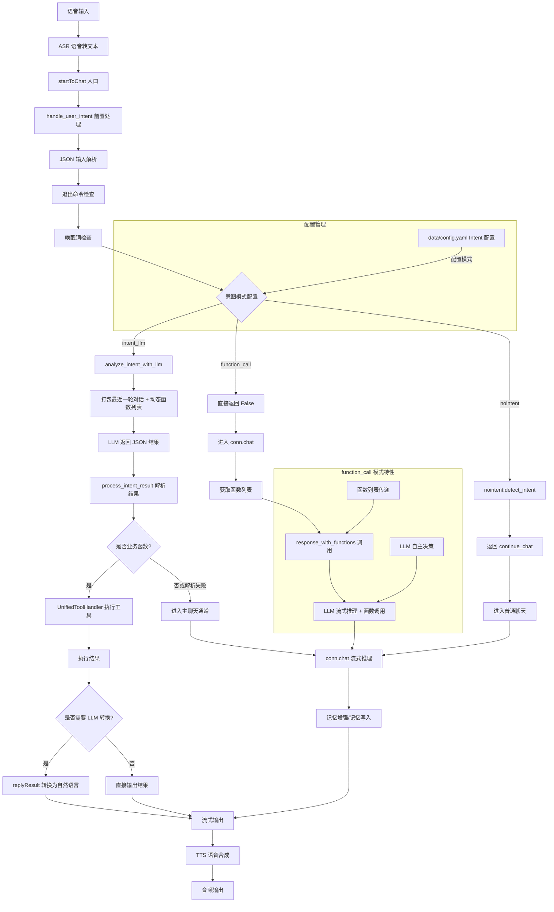
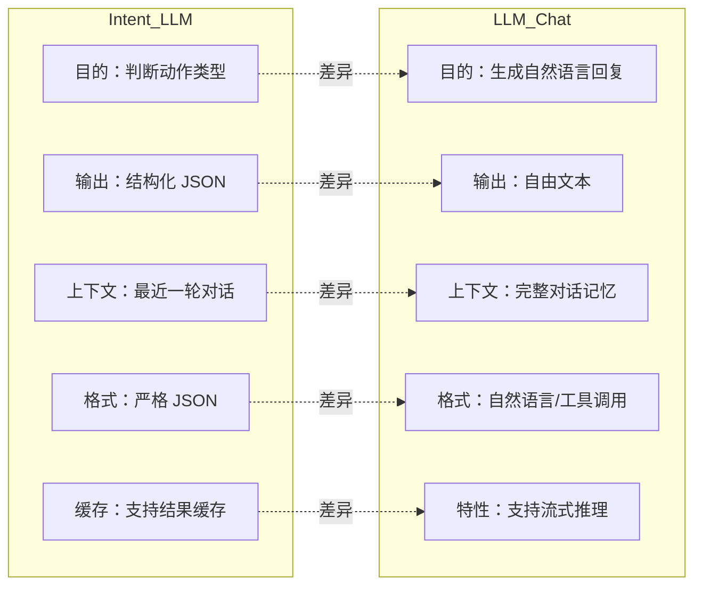
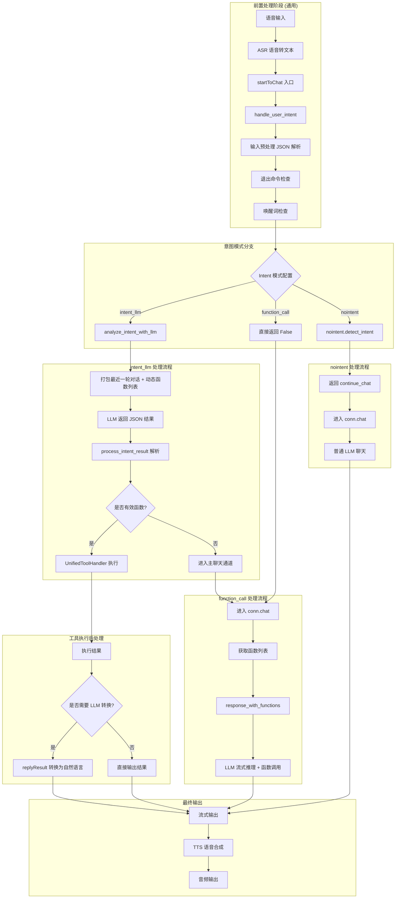
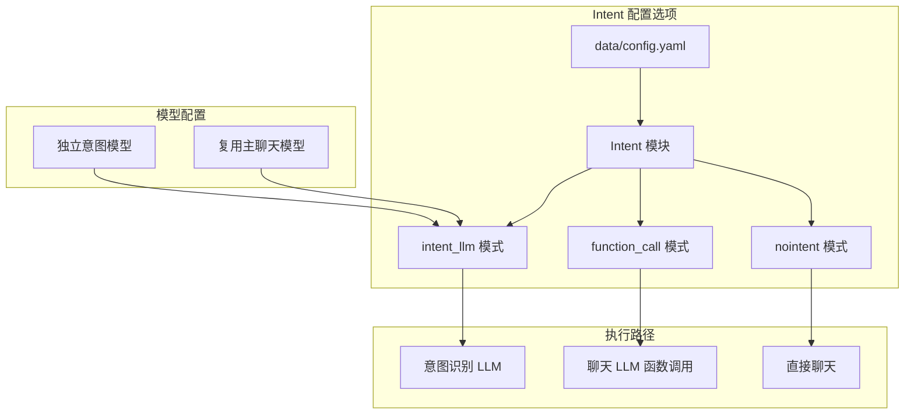
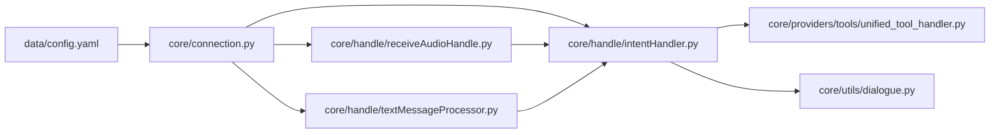
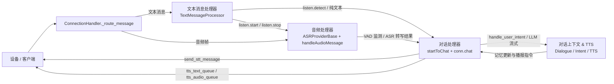

# 意图与对话系统架构流程图

## 系统整体流程（修正版）



## 意图 vs LLM 对比分析



## 详细执行路径

### 实际代码执行流程（修正版）



## 配置架构



## 前置处理步骤详解

### 所有模式共用的前置处理

1. 对输入文本尝试 JSON 解析，抽取 `speaker`、`content` 等字段。
2. 通过 `remove_punctuation_and_length` 做轻量清洗，用于退出指令和唤醒词判断。（参见 `core/utils/util.py`）
3. 检测是否命中 `conn.cmd_exit` 的退出指令，命中则直接结束对话。（参见 `core/handle/intentHandler.py:36`）
4. 检测是否命中唤醒词并根据配置决定是否立即回复问候。（参见 `core/handle/helloHandle.py`）
5. 根据 `Intent` 配置进入不同的后续流程。

### 关键处理逻辑

- `intent_llm`：调用专用意图识别模型，期望返回 JSON，随后走 `process_intent_result`。主要逻辑集中在 `core/handle/intentHandler.py:62-180`。
- `function_call`：直接转入 `conn.chat`，由主 LLM 的函数调用能力完成工具选择。逻辑集中在 `core/connection.py:746-1015`。
- `nointent`：返回 `continue_chat`，视为没有特殊意图，交给普通聊天逻辑处理。

## 关键文件关系



## 各模式详细对比

### 处理步骤对比

| 模式 | 意图识别 | 函数调用触发方 | 输出路径 | 典型用途 |
| --- | --- | --- | --- | --- |
| `intent_llm` | 专用意图模型 | `process_intent_result` 调用工具 | 工具执行 → 可选二次 LLM → TTS | 结构化指令、设备控制 |
| `function_call` | 无单独识别，依赖 LLM | LLM `response_with_functions` | 流式函数调用 → LLM 继续对话 | 强依赖工具生态的助手 |
| `nointent` | 跳过意图识别 | 无 | 直接进入普通聊天 | 纯闲聊或快速验证 |

### 关键代码位置对比

- `intent_llm`
  - 入口：`core/handle/intentHandler.py:62`
  - 工具执行：`core/providers/tools/unified_tool_handler.py`
  - 结果播报：`core/handle/intentHandler.py:139`
- `function_call`
  - 入口：`core/handle/intentHandler.py:49`（返回 False）
  - 函数列表：`core/providers/tools/unified_tool_handler.py:get_functions`
  - 流式处理：`core/connection.py:822-1005`
- `nointent`
  - 入口：`core/handle/intentHandler.py:55`
  - 直接转入聊天：`core/connection.py:746`

### 性能特征对比

| 指标 | `intent_llm` | `function_call` | `nointent` |
| --- | --- | --- | --- |
| 首次响应延迟 | 取决于意图模型推理 | 取决于主 LLM | 最低 |
| 工具调用次数 | 由意图模型控制 | 由 LLM 决策 | 无 |
| 失败恢复 | JSON 解析失败会兜底到聊天 | LLM 可重新规划 | 直接转聊天 |
| 适配难度 | 需维护提示和解析逻辑 | 需设计函数 schema | 最低 |

## 关键概念澄清：两种不同的 "function_call"

### 重要发现：同名但本质不同的 function_call

- `intent_llm` 中的 `function_call`：意图模型返回的 JSON 字段，描述应调用的业务工具。
- `function_call` 模式中的 `function_call`：OpenAI/GPT 风格的函数调用协议，由 LLM 在推理时主动触发。

### 1. intent_llm 模式中的 "function_call"（JSON 描述式）

- 来源：意图识别结果 JSON 内的 `function_call` 字段。
- 处理：`process_intent_result` 解析函数名和参数，交给 `UnifiedToolHandler` 执行。
- 失败兜底：若函数名为 `continue_chat` 或解析失败，自动进入普通聊天。

### 2. function_call 模式中的 "function_call"（API 原生式）

- 来源：`conn.chat` 中 `response_with_functions` 的流式返回。
- 处理：`UnifiedToolHandler` 暴露函数 schema 给 LLM，LLM 直接选择并返回参数。
- 失败兜底：LLM 可继续生成自然语言或再次尝试函数调用。

### 核心区别总结

| 维度 | intent_llm | function_call |
| --- | --- | --- |
| 决策主体 | 意图识别模型 | 主 LLM |
| 参数格式 | JSON 字符串（需解析） | API 原生 JSON（schema 校验） |
| 触发时机 | 意图识别阶段 | LLM 推理阶段 |
| 失败策略 | 进入聊天兜底 | LLM 自行调整 |

## 实际代码执行路径详解

### function_call 模式的真实执行路径

1. `handle_user_intent` 返回 `False`（`core/handle/intentHandler.py:49`）。
2. `startToChat` 调用 `conn.executor.submit(conn.chat, text)`（`core/handle/receiveAudioHandle.py:132`）。
3. `conn.chat` 通过 `response_with_functions` 启动流式对话（`core/connection.py:822`）。
4. LLM 返回 `tool_calls`，由 `UnifiedToolHandler` 执行并将结果写回对话（`core/connection.py:905`）。
5. 最终调用 `tts.tts_one_sentence` 输出语音（`core/connection.py:972`）。

### 各模式在 `connection.py` 中的差异化处理

- 函数列表获取：`self.func_handler.get_functions()` 仅在 `function_call` 模式使用。
- 响应流处理：`intent_llm` 和 `nointent` 走 `llm.response`，`function_call` 走 `response_with_functions`。
- 聊天记忆：三种模式最终都通过 `Dialogue` 维护上下文。

### 重要的设计细节

- `conn.intent_type` 决定是否需要加载工具处理器和专用 LLM。（`core/connection.py:658`）
- `UnifiedToolHandler._initialize()` 异步加载插件，确保函数 schema 可用。（`core/connection.py:694`）
- 所有模式共用的 `speak_txt` 负责写入对话和触发 TTS。（`core/handle/intentHandler.py:183`）

### 配置文件的实际影响

- `Intent.selected_module.Intent` 控制三种模式切换。
- `intent_llm` 可配置独立模型名称与提示词。
- `function_call` 需确保工具在 `plugins_func.functions` 下正确定义。

### LLM 如何知道可用工具：两种机制

#### 1. intent_llm 模式：通过提示词告知

- 配置中为意图模型准备系统提示，列出业务动作与参数要求。
- `process_intent_result` 解析后的函数名再交给工具处理器执行。

#### 2. function_call 模式：通过 API 参数告知

- `conn.chat` 将工具 schema 通过 `tools` 参数传给 LLM。
- LLM 在流式响应中直接构造 `tool_calls`。

### 工具调用发起方对比

| 模式 | 发起方 | 触发位置 |
| --- | --- | --- |
| `intent_llm` | Intent 模型 | `process_intent_result` |
| `function_call` | 主 LLM | `conn.chat` 流式推理 |
| `nointent` | 无 | 不涉及 |

## 总结与最佳实践

### 关键认知修正

- `intent_llm` 与 `function_call` 名字相似但职责完全不同。
- 三种模式最终都进入 `conn.chat`，差异在于是否提前确定工具调用。
- 工具执行统一通过 `UnifiedToolHandler`，便于扩展和监管。

### 模式选择指南（基于实际需求）

#### 选择 intent_llm 模式的场景

- 需要稳定、可控的结构化指令执行。
- 需要在调用工具前做安全过滤或业务约束。

#### 选择 function_call 模式的场景

- 追求对话自然性，允许 LLM 自由决定工具调用顺序。
- 工具 schema 设计完善，且希望利用 OpenAI/GPT 原生 API 行为。

#### 选择 nointent 模式的场景

- 纯闲聊或实验环境，不需要工具。
- 希望最小化延迟，快速验证对话链路。

#### 实际配置示例

```yaml
Intent:
  selected_module:
    Intent: "intent_llm"
  intent_llm:
    llm: "intent_model"
    type: "intent_llm"
```

```yaml
Intent:
  selected_module:
    Intent: "function_call"
  function_call:
    type: "function_call"
```

```yaml
Intent:
  selected_module:
    Intent: "nointent"
  nointent:
    type: "nointent"
```

## 消息处理层组件关系

文本消息处理器、音频处理器和对话处理器共用 `ConnectionHandler` 的连接态，通过共享的 `conn` 会话对象协同工作：前两者负责输入解析与触发，对话处理器负责意图判断、LLM 对话与语音播报。整体关系如下。


