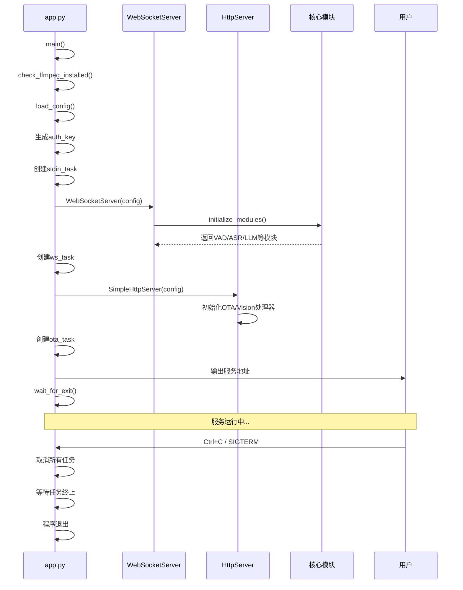

# 小智ESP32服务器 - app.py 详细架构分析

## 概述

本文档详细分析了小智ESP32服务器的核心入口文件 `app.py` 的架构设计和启动功能。该文件是整个系统的启动协调器，负责初始化和管理所有核心服务。

## app.py 程序框图

### 文本流程图
```
app.py 主程序
    ↓
main() 异步主函数
    ↓
┌─────────────────────────────────────┐
│           初始化阶段                │
├─────────────────────────────────────┤
│ 1. 检查FFmpeg安装                  │
│ 2. 加载配置 load_config            │
│ 3. 生成认证密钥 auth_key            │
└─────────────────────────────────────┘
    ↓
┌─────────────────────────────────────┐
│           服务启动                  │
├─────────────────────────────────────┤
│ 4. 启动标准输入监控                 │
│ 5. 启动WebSocket服务器              │
│ 6. 启动HTTP服务器                   │
└─────────────────────────────────────┘
    ↓
┌─────────────────────────────────────┐
│           地址输出                  │
├─────────────────────────────────────┤
│ 7. OTA接口地址                      │
│ 8. 视觉分析接口地址                  │
│ 9. MCP接入点地址                    │
│ 10. WebSocket地址                   │
└─────────────────────────────────────┘
    ↓
┌─────────────────────────────────────┐
│           运行阶段                  │
├─────────────────────────────────────┤
│ 11. 等待退出信号                    │
│ 12. 监控服务状态                    │
└─────────────────────────────────────┘
    ↓
┌─────────────────────────────────────┐
│           清理阶段                  │
├─────────────────────────────────────┤
│ 13. 取消所有任务                    │
│ 14. 等待任务终止                    │
│ 15. 程序退出                        │
└─────────────────────────────────────┘
```

### 详细组件关系图
```
┌─────────────────────────────────────────────────────────────────┐
│                        app.py 主程序                            │
└─────────────────────┬───────────────────┬───────────────────────┘
                      │                   │
                      ↓                   ↓
┌─────────────────────────────────┐ ┌─────────────────────────────────┐
│        WebSocket服务器           │ │        HTTP服务器                │
├─────────────────────────────────┤ ├─────────────────────────────────┤
│ • WebSocketServer类初始化       │ │ • SimpleHttpServer类初始化       │
│ • 初始化核心模块:               │ │ • OTA处理器初始化               │
│   - VAD (语音活动检测)          │ │ • 视觉分析处理器初始化           │
│   - ASR (语音识别)              │ │ • 创建异步任务 ota_task         │
│   - LLM (大语言模型)            │ │                                 │
│   - Memory (记忆系统)           │ │ • 路由配置:                    │
│   - Intent (意图识别)           │ │   - OTA接口: /xiaozhi/ota/     │
│ • 创建异步任务 ws_task           │ │   - 视觉分析: /mcp/vision/explain│
│ • 处理WebSocket连接             │ │                                 │
│ • 支持HTTP请求响应              │ │ • 服务器启动:                   │
│ • 配置热更新支持                │ │   - aiohttp框架                │
└─────────────────────────────────┘   - 异步处理                   │
                      │                - CORS处理                    │
                      │                - 持久运行                    │
                      ↓               └─────────────────────────────────┘
┌─────────────────────────────────┐                    │
│        异步任务管理              │                    │
├─────────────────────────────────┤                    │
│ • stdin_task: 标准输入监控       │                    │
│ • ws_task: WebSocket服务         │                    ↓
│ • ota_task: HTTP服务             │         ┌─────────────────────────────────┐
└─────────────────────────────────┘         │          服务地址输出              │
                      │                     ├─────────────────────────────────┤
                      ↓                     │ • OTA接口: http://ip:port/xiaozhi/ota/ │
┌─────────────────────────────────┐         │ • 视觉分析: http://ip:port/mcp/vision/explain │
│        信号处理机制             │         │ • WebSocket: ws://ip:port/xiaozhi/v1/  │
├─────────────────────────────────┤         │ • MCP接入点: 配置的websocket地址     │
│ • Unix: SIGINT/SIGTERM处理      │         └─────────────────────────────────┘
│ • Windows: KeyboardInterrupt处理  │                     │
│ • 统一退出机制                   │                     ↓
└─────────────────────────────────┘         ┌─────────────────────────────────┐
                      │                     │          MCP支持                  │
                      ↓                     ├─────────────────────────────────┤
┌─────────────────────────────────┐         │ • 验证接入点格式                │
│        资源清理功能             │         │ • 转换接入点为调用点            │
├─────────────────────────────────┤         │ • 支持Model Context Protocol   │
│ • 取消所有异步任务              │         └─────────────────────────────────┘
│ • 等待任务终止(3秒超时)         │
│ • 确保程序干净退出              │
└─────────────────────────────────┘
```

## 启动时序图



## 详细启动功能说明

### 1. 环境检查功能

#### 1.1 FFmpeg 依赖检查
```python
def check_ffmpeg_installed():
    """检查FFmpeg是否安装"""
    # 验证音频处理依赖是否可用
    # 如果未安装会抛出异常，阻止程序启动
```

**功能说明：**
- 检查系统中是否安装了FFmpeg
- FFmpeg是音频处理的必要依赖
- 如果未找到，程序会抛出异常并终止

**重要性：** ⭐⭐⭐⭐⭐
- 音频编解码的核心依赖
- 确保系统具备基本的音频处理能力

### 2. 配置管理功能

#### 2.1 配置文件加载
```python
config = load_config()
```

**配置加载优先级：**
1. `config.yaml` - 默认配置文件
2. `data/.config.yaml` - 用户自定义配置
3. 智控台API配置（如果启用）

**配置合并机制：**
- 递归合并配置字典
- 用户配置覆盖默认配置
- 支持嵌套配置结构

#### 2.2 认证密钥生成
```python
auth_key = config.get("manager-api", {}).get("secret", "")
if not auth_key or len(auth_key) == 0 or "你" in auth_key:
    auth_key = str(uuid.uuid4().hex)
config["server"]["auth_key"] = auth_key
```

**功能说明：**
- 优先使用智控台的secret作为认证密钥
- 如果secret为空或包含默认值，生成UUID密钥
- 用于JWT认证，特别是视觉分析接口

**重要性：** ⭐⭐⭐⭐
- 确保API接口的安全性
- 支持分布式部署的认证需求

### 3. 标准输入监控功能

#### 3.1 异步输入监控
```python
async def monitor_stdin():
    """监控标准输入，消费回车键"""
    while True:
        await ainput()  # 异步等待输入，消费回车
```

**功能说明：**
- 创建异步任务监控标准输入
- 消费回车键，防止输入流阻塞
- 解决Windows平台的退出问题

**技术实现：**
- 使用 `aioconsole.ainput()` 进行异步输入处理
- 无限循环持续监控
- 防止程序因输入流阻塞而无法正常退出

**重要性：** ⭐⭐⭐
- 跨平台兼容性的关键设计
- 确保程序能够正常响应退出信号

### 4. WebSocket服务器启动

#### 4.1 服务器初始化
```python
ws_server = WebSocketServer(config)
```

**初始化过程：**
1. 创建WebSocketServer实例
2. 传入配置字典
3. 创建配置锁用于热更新
4. 初始化核心模块

#### 4.2 核心模块初始化
```python
modules = initialize_modules(
    self.logger,
    self.config,
    "VAD" in self.config["selected_module"],
    "ASR" in self.config["selected_module"],
    "LLM" in self.config["selected_module"],
    False,
    "Memory" in self.config["selected_module"],
    "Intent" in self.config["selected_module"],
)
```

**模块化初始化特点：**
- **VAD**: 语音活动检测模块
- **ASR**: 语音识别模块
- **LLM**: 大语言模型模块
- **Memory**: 记忆系统模块
- **Intent**: 意图识别模块

**配置驱动选择：**
- 根据 `selected_module` 配置决定启用哪些模块
- 支持模块的独立启用/禁用
- 动态加载对应的提供商实现

#### 4.3 异步任务创建
```python
ws_task = asyncio.create_task(ws_server.start())
```

**服务器启动功能：**
- 监听指定IP和端口（默认0.0.0.0:8000）
- 处理WebSocket连接升级
- 支持HTTP请求响应
- 为每个连接创建独立的ConnectionHandler

**连接管理功能：**
- 维护活动连接集合
- 处理连接异常和清理
- 支持连接状态监控

#### 4.4 配置热更新支持
```python
async def update_config(self) -> bool:
    """更新服务器配置并重新初始化组件"""
```

**热更新功能：**
- 支持运行时配置更新
- 重新初始化必要的模块
- 检查VAD和ASR类型变更
- 确保服务不中断的情况下更新配置

**重要性：** ⭐⭐⭐⭐⭐
- 系统的核心服务
- 实时音频通信的基础
- 支持动态配置更新

### 5. HTTP服务器启动

#### 5.1 服务器初始化
```python
ota_server = SimpleHttpServer(config)
```

**初始化组件：**
- OTA处理器：`OTAHandler(config)`
- 视觉分析处理器：`VisionHandler(config)`
- 日志系统设置

#### 5.2 路由配置
```python
if not read_config_from_api:
    # 单模块运行时的OTA接口
    app.add_routes([
        web.get("/xiaozhi/ota/", self.ota_handler.handle_get),
        web.post("/xiaozhi/ota/", self.ota_handler.handle_post),
        web.options("/xiaozhi/ota/", self.ota_handler.handle_post),
    ])

# 视觉分析接口
app.add_routes([
    web.get("/mcp/vision/explain", self.vision_handler.handle_get),
    web.post("/mcp/vision/explain", self.vision_handler.handle_post),
    web.options("/mcp/vision/explain", self.vision_handler.handle_post),
])
```

**接口功能：**
- **OTA接口**: 设备固件升级
  - GET: 获取升级信息
  - POST: 上传固件文件
  - OPTIONS: CORS预检请求
- **视觉分析接口**: 多模态理解
  - GET: 简单的图像分析
  - POST: 复杂的视觉理解
  - OPTIONS: CORS预检请求

#### 5.3 服务器启动
```python
runner = web.AppRunner(app)
await runner.setup()
site = web.TCPSite(runner, host, port)
await site.start()

# 保持服务运行
while True:
    await asyncio.sleep(3600)  # 每隔1小时检查一次
```

**技术特点：**
- 使用aiohttp框架
- 支持异步处理
- 自动CORS处理
- 持久运行机制

**重要性：** ⭐⭐⭐⭐
- 提供关键的辅助服务
- 支持设备升级和视觉分析
- 与WebSocket服务器形成互补

### 6. 服务地址输出

#### 6.1 地址计算和输出
```python
# OTA接口地址
if not read_config_from_api:
    logger.bind(tag=TAG).info(
        "OTA接口是\t\thttp://{}:{}/xiaozhi/ota/",
        get_local_ip(),
        port,
    )

# 视觉分析接口地址
logger.bind(tag=TAG).info(
    "视觉分析接口是\thttp://{}:{}/mcp/vision/explain",
    get_local_ip(),
    port,
)

# WebSocket地址
logger.bind(tag=TAG).info(
    "Websocket地址是\tws://{}:{}/xiaozhi/v1/",
    get_local_ip(),
    websocket_port,
)
```

**地址配置策略：**
- **自动获取**: 使用 `get_local_ip()` 获取本地IP
- **配置覆盖**: 支持在配置文件中自定义地址
- **智能提示**: 区分WebSocket和HTTP协议的访问方式

**用户指导信息：**
```
=======上面的地址是websocket协议地址，请勿用浏览器访问=======
如想测试websocket请用谷歌浏览器打开test目录下的test_page.html
=============================================================
```

**重要性：** ⭐⭐⭐
- 帮助用户了解服务访问地址
- 避免协议混淆导致的访问错误
- 提供测试工具的使用指导

### 7. MCP接入点支持

#### 7.1 MCP配置验证
```python
mcp_endpoint = config.get("mcp_endpoint", None)
if mcp_endpoint is not None and "你" not in mcp_endpoint:
    # 校验MCP接入点格式
    if validate_mcp_endpoint(mcp_endpoint):
        logger.bind(tag=TAG).info("mcp接入点是\t{}", mcp_endpoint)
        # 将mcp计入点地址转成调用点
        mcp_endpoint = mcp_endpoint.replace("/mcp/", "/call/")
        config["mcp_endpoint"] = mcp_endpoint
    else:
        logger.bind(tag=TAG).error("mcp接入点不符合规范")
        config["mcp_endpoint"] = "你的接入点 websocket地址"
```

**MCP (Model Context Protocol) 支持：**
- 验证接入点地址格式
- 转换接入点为调用点
- 支持Model Context Protocol集成

**功能说明：**
- 支持第三方MCP服务接入
- 提供统一的协议转换
- 增强系统的扩展性

**重要性：** ⭐⭐⭐
- 支持现代化的AI服务协议
- 增强系统的互操作性
- 为未来扩展奠定基础

### 8. 信号处理机制

#### 8.1 跨平台信号处理
```python
async def wait_for_exit() -> None:
    """
    阻塞直到收到 Ctrl‑C / SIGTERM。
    - Unix: 使用 add_signal_handler
    - Windows: 依赖 KeyboardInterrupt
    """
    loop = asyncio.get_running_loop()
    stop_event = asyncio.Event()

    if sys.platform != "win32":  # Unix / macOS
        for sig in (signal.SIGINT, signal.SIGTERM):
            loop.add_signal_handler(sig, stop_event.set)
        await stop_event.wait()
    else:
        # Windows：await一个永远pending的fut，
        # 让 KeyboardInterrupt 冒泡到 asyncio.run
        try:
            await asyncio.Future()
        except KeyboardInterrupt:  # Ctrl‑C
            pass
```

**跨平台处理策略：**
- **Unix/macOS**: 使用信号处理器监听 SIGINT/SIGTERM
- **Windows**: 捕获 KeyboardInterrupt 异常
- **统一接口**: 为不同平台提供统一的退出机制

**技术实现：**
- 使用 `asyncio.Event` 作为退出信号
- Unix系统通过 `add_signal_handler` 注册信号处理
- Windows系统通过异常捕获实现退出处理

**重要性：** ⭐⭐⭐⭐⭐
- 确保程序能够优雅退出
- 跨平台兼容性的关键设计
- 防止资源泄漏和程序僵死

### 9. 资源清理功能

#### 9.1 任务取消机制
```python
finally:
    # 取消所有任务（关键修复点）
    stdin_task.cancel()
    ws_task.cancel()
    if ota_task:
        ota_task.cancel()

    # 等待任务终止（必须加超时）
    await asyncio.wait(
        [stdin_task, ws_task, ota_task] if ota_task else [stdin_task, ws_task],
        timeout=3.0,
        return_when=asyncio.ALL_COMPLETED,
    )
    print("服务器已关闭，程序退出。")
```

**清理流程：**
1. **任务取消**: 调用 `cancel()` 方法取消所有异步任务
2. **等待终止**: 使用 `asyncio.wait()` 等待任务完成
3. **超时控制**: 设置3秒超时防止无限等待
4. **状态确认**: 确保所有任务都已正确终止

**异常处理：**
- 捕获 `asyncio.CancelledError` 异常
- 确保资源清理过程不会中断
- 提供清晰的退出状态反馈

**重要性：** ⭐⭐⭐⭐⭐
- 防止资源泄漏
- 确保系统能够干净退出
- 避免僵尸进程和端口占用

## 关键设计特点

### 1. 双服务器架构
- **WebSocket服务器**: 处理实时音频通信
- **HTTP服务器**: 提供辅助服务接口
- **并行运行**: 两个服务器在同一个事件循环中运行

### 2. 异步并发设计
- 使用 `asyncio` 构建的全异步架构
- 支持高并发连接处理
- 非阻塞的I/O操作

### 3. 模块化初始化
- 根据配置动态加载所需模块
- 支持模块的独立启用/禁用
- 插件化的扩展能力

### 4. 配置驱动架构
- 系统行为完全由配置文件控制
- 支持运行时配置更新
- 灵活的提供商选择机制

### 5. 优雅退出机制
- 完善的信号处理
- 系统化的资源清理
- 跨平台的兼容性

### 6. 错误处理和恢复
- 异常捕获和处理
- 连接状态管理
- 自动恢复机制

## 启动功能重要性评级

| 功能模块 | 重要性 | 说明 |
|---------|--------|------|
| 信号处理 | ⭐⭐⭐⭐⭐ | 确保程序能够优雅退出 |
| 资源清理 | ⭐⭐⭐⭐⭐ | 防止资源泄漏和僵尸进程 |
| WebSocket服务器 | ⭐⭐⭐⭐⭐ | 系统核心服务，实时通信 |
| 配置管理 | ⭐⭐⭐⭐ | 系统行为控制的基础 |
| HTTP服务器 | ⭐⭐⭐⭐ | 提供关键的辅助服务 |
| 认证密钥 | ⭐⭐⭐⭐ | API安全性保障 |
| 环境检查 | ⭐⭐⭐⭐ | 依赖检查，确保系统可用性 |
| 服务地址输出 | ⭐⭐⭐ | 用户体验优化 |
| 标准输入监控 | ⭐⭐⭐ | 跨平台兼容性 |
| MCP支持 | ⭐⭐⭐ | 扩展性支持 |

## 总结

`app.py` 作为小智ESP32服务器的入口文件，体现了以下设计原则：

1. **简洁性**: 代码结构清晰，职责明确
2. **可靠性**: 完善的错误处理和资源管理
3. **可扩展性**: 模块化设计，支持动态配置
4. **跨平台**: 支持Windows和Unix系统
5. **高性能**: 异步架构，支持高并发

这个设计确保了系统的高可用性、可维护性和可扩展性，为整个小智ESP32服务器提供了坚实的基础。